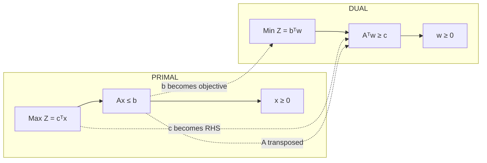
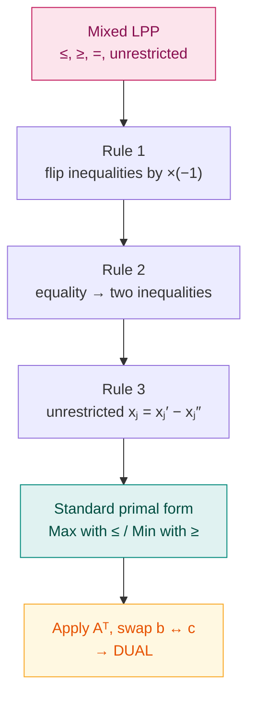

# 9. Duality in Linear Programming

> **Syllabus:** From the beginning — **up to duality** (this is the last topic)
> **Source:** `class Note 5.pdf` — *Class Notes on Duality in Linear Programming*

---

## 🎯 In one line

Every LPP (the **primal**) has a partner LPP (the **dual**) built by **transposing** $A$, swapping $b \leftrightarrow c$, and flipping max $\leftrightarrow$ min — and both have the **same optimal value**.

---

## 1. Introduction

Every Linear Programming Problem is associated with another LPP called its **dual problem**. The original problem is called the **primal**.

$$\text{Primal Problem} \longleftrightarrow \text{Dual Problem}$$

The primal and dual are **two different ways of looking at the same optimization problem**:

| | Question it asks |
|---|---|
| **Primal** | *How many units of each product should be produced to maximize profit?* |
| **Dual** | *What values should be assigned to the available resources, so their total value is minimum while still accounting for the profit of each product?* |

---

## 2. Worked motivation — where the dual comes from ⭐

A company produces Product 1 and Product 2. Profit per unit: Rs. 3 and Rs. 2.

| | Product 1 | Product 2 | Available |
|---|---|---|---|
| Resource 1 | 1 | 1 | 4 |
| Resource 2 | 2 | 1 | 6 |

### The primal

Let $x_1, x_2$ = units of Product 1, 2 produced.

$$
\begin{aligned}
\text{Maximize } && Z_P &= 3x_1 + 2x_2 \\
\text{subject to } && x_1 + x_2 &\le 4 &&\text{(Resource 1)} \\
&& 2x_1 + x_2 &\le 6 &&\text{(Resource 2)} \\
&& x_1, x_2 &\ge 0
\end{aligned}
$$

> **Primal problem = how much of each product should be produced?**

### Forming the dual

The primal has **two resource constraints**, so introduce **two dual variables**:
- $w_1$ = value of one unit of Resource 1
- $w_2$ = value of one unit of Resource 2

**Objective.** Since 4 units of Resource 1 and 6 units of Resource 2 are available, the total value of the resources is $4w_1 + 6w_2$. We **minimize** because we want the *smallest* total resource value that is still sufficient to account for the profits:

$$\text{Minimize } Z_D = 4w_1 + 6w_2$$

**First dual constraint.** One unit of Product 1 needs 1 unit of Resource 1 and 2 units of Resource 2, so the value of resources consumed is $w_1 + 2w_2$. The profit from one unit of Product 1 is Rs. 3. The resource value must be **at least** the profit:

$$w_1 + 2w_2 \ge 3$$

**Second dual constraint.** One unit of Product 2 needs 1 unit of each resource → value $w_1 + w_2$, profit Rs. 2:

$$w_1 + w_2 \ge 2$$

### ✅ The dual

$$
\begin{aligned}
\text{Minimize } && Z_D &= 4w_1 + 6w_2 \\
\text{subject to } && w_1 + 2w_2 &\ge 3 \\
&& w_1 + w_2 &\ge 2 \\
&& w_1, w_2 &\ge 0
\end{aligned}
$$

> 💡 **Notice the swap.** The primal's *right-hand sides* $(4, 6)$ became the dual's *objective coefficients*. The primal's *objective coefficients* $(3, 2)$ became the dual's *right-hand sides*. The primal's constraint **rows** became the dual's constraint **columns**.

---

## 3. Symmetric Dual — the standard pair ⭐⭐

**Primal**

$$
\begin{aligned}
\text{Maximize } && Z_P &= c_1x_1 + c_2x_2 + \cdots + c_nx_n \\
\text{s.t. } && a_{11}x_1 + \cdots + a_{1n}x_n &\le b_1 \\
&& &\ \ \vdots \\
&& a_{m1}x_1 + \cdots + a_{mn}x_n &\le b_m \\
&& x_1,\dots,x_n &\ge 0
\end{aligned}
$$

**Dual**

$$
\begin{aligned}
\text{Minimize } && Z_D &= b_1w_1 + b_2w_2 + \cdots + b_mw_m \\
\text{s.t. } && a_{11}w_1 + a_{21}w_2 + \cdots + a_{m1}w_m &\ge c_1 \\
&& &\ \ \vdots \\
&& a_{1n}w_1 + a_{2n}w_2 + \cdots + a_{mn}w_m &\ge c_n \\
&& w_1,\dots,w_m &\ge 0
\end{aligned}
$$

$$\boxed{\text{Max with } \le \qquad\longleftrightarrow\qquad \text{Min with } \ge}$$

### Matrix form

$$
\underbrace{\begin{aligned}
\text{Max } Z_P &= c^Tx \\ Ax &\le b \\ x &\ge 0
\end{aligned}}_{\textbf{PRIMAL}}
\qquad\Longleftrightarrow\qquad
\underbrace{\begin{aligned}
\text{Min } Z_D &= b^Tw \\ A^Tw &\ge c \\ w &\ge 0
\end{aligned}}_{\textbf{DUAL}}
$$

> ⭐ **The important transformation is $A \to A^T$.** Therefore the **rows** of the primal coefficient matrix become the **columns** of the dual coefficient matrix.

### Standard form convention used in these notes

| Type of LPP | Standard form of constraints |
|---|---|
| **Maximization** problem | all $\le$ |
| **Minimization** problem | all $\ge$ |

$$\text{Maximization: } Ax \le b,\ x\ge0 \qquad\qquad \text{Minimization: } Ax \ge b,\ x \ge 0$$

---

## 4. The conversion table — memorise this ⭐⭐

| **PRIMAL** (Maximization) | **DUAL** (Minimization) |
|---|---|
| Objective: Maximize $Z_P$ | Objective: Minimize $Z_D$ |
| $m$ constraints | $m$ variables |
| $n$ variables | $n$ constraints |
| Coefficient matrix $A$ | Coefficient matrix $A^T$ |
| RHS vector $b$ | Objective coefficients $b$ |
| Objective coefficients $c$ | RHS vector $c$ |
| $i$-th constraint is $\le$ | $i$-th variable $w_i \ge 0$ |
| $i$-th constraint is $=$ | $i$-th variable $w_i$ **unrestricted in sign** |
| $j$-th variable $x_j \ge 0$ | $j$-th constraint is $\ge$ |
| $j$-th variable **unrestricted** | $j$-th constraint is $=$ |

$$\boxed{\text{Primal equality} \ \Longleftrightarrow\ \text{unrestricted dual variable}}$$

> 📌 **The dual of the dual is the primal.** Converting twice returns you to where you started.

---

## 5. Worked Example 1 — standard minimization primal

$$
\begin{aligned}
\text{Minimize } && Z_P &= 3x_1 + x_2 \\
\text{s.t. } && 2x_1 + 3x_2 &\ge 2 \\
&& x_1 + x_2 &\ge 1 \\
&& x_1, x_2 &\ge 0
\end{aligned}
$$

This is already in standard minimization form (all $\ge$). In matrix form:

$$A = \begin{bmatrix} 2&3 \\ 1&1\end{bmatrix},\qquad b = \begin{bmatrix}2\\1\end{bmatrix},\qquad c = \begin{bmatrix}3\\1\end{bmatrix}$$

Since the primal is a **minimization**, its dual is a **maximization**. Introduce two dual variables $w_1, w_2$ (one per primal constraint).

The dual objective uses the primal RHS: $Z_D = 2w_1 + w_2$. The transpose is

$$A^T = \begin{bmatrix} 2&1 \\ 3&1\end{bmatrix}$$

### ✅ Dual

$$
\begin{aligned}
\text{Maximize } && Z_D &= 2w_1 + w_2 \\
\text{s.t. } && 2w_1 + w_2 &\le 3 \\
&& 3w_1 + w_2 &\le 1 \\
&& w_1, w_2 &\ge 0
\end{aligned}
$$

$$\text{Min with } \ge \quad\longleftrightarrow\quad \text{Max with } \le$$

---

## 6. Unsymmetrical Dual — equality constraints

Suppose the primal contains **equality** constraints:

$$\text{Maximize } Z_P = c^Tx, \qquad Ax = b, \qquad x \ge 0$$

Then its dual is

$$\text{Minimize } Z_D = b^Tw, \qquad A^Tw \ge c$$

where the dual variables $w_1,\dots,w_m$ are **unrestricted in sign**.

### Worked Example 2 — primal with equalities

$$
\begin{aligned}
\text{Maximize } && Z_P &= 2x_1 + 3x_2 + x_3 \\
\text{s.t. } && 4x_1 + 3x_2 + x_3 &= 6 \\
&& x_1 + 2x_2 + 5x_3 &= 4 \\
&& x_1, x_2, x_3 &\ge 0
\end{aligned}
$$

There are **two equality constraints** → introduce two dual variables $w_1, w_2$, both **unrestricted in sign**.

The RHS constants $6$ and $4$ form the dual objective: $Z_D = 6w_1 + 4w_2$. There are **three primal variables**, so there will be **three dual constraints**, read from the **columns** of the primal coefficient matrix.

### ✅ Dual

$$
\begin{aligned}
\text{Minimize } && Z_D &= 6w_1 + 4w_2 \\
\text{s.t. } && 4w_1 + w_2 &\ge 2 \\
&& 3w_1 + 2w_2 &\ge 3 \\
&& w_1 + 5w_2 &\ge 1 \\
&& w_1, w_2 &\ \text{unrestricted in sign}
\end{aligned}
$$

---

## 7. Dual of a Mixed System ⭐

An LPP may contain $\le$, $\ge$, $=$ constraints together with unrestricted variables. **The safest method is: first convert the problem into standard primal form, then construct the dual.**

### Rule 1 — changing the direction of an inequality

Multiply the whole constraint by $-1$ and reverse the sign.

$$2x_1 + x_2 \ge 6 \quad\Longrightarrow\quad -2x_1 - x_2 \le -6$$

### Rule 2 — equality constraint

An equality is equivalent to **two opposite inequalities**:

$$a^Tx = b \quad\Longleftrightarrow\quad a^Tx \le b \ \text{ and } \ a^Tx \ge b$$

### Rule 3 — unrestricted variable

If $x_j$ is unrestricted in sign, write

$$x_j = x_j' - x_j'' \qquad\text{where } x_j', x_j'' \ge 0$$

This converts an unrestricted variable into **two non-negative** variables.

### Worked Example 3 — mixed system

$$
\begin{aligned}
\text{Minimize } && Z_P &= 2x_2 + 5x_3 \\
\text{s.t. } && x_1 + x_2 &\ge 2 \\
&& 2x_1 + x_2 + 6x_3 &\le 6 \\
&& x_1 - x_2 + 3x_3 &= 4 \\
&& x_1,x_2,x_3 &\ge 0
\end{aligned}
$$

**Step 1 — convert all constraints to $\ge$** (minimization standard form).

- $x_1 + x_2 \ge 2$ — already $\ge$ ✓
- $2x_1+x_2+6x_3 \le 6$ → multiply by $-1$: $-2x_1-x_2-6x_3 \ge -6$
- $x_1-x_2+3x_3 = 4$ → replace by $x_1-x_2+3x_3 \ge 4$ **and** $x_1-x_2+3x_3 \le 4$; multiplying the second by $-1$ gives $-x_1+x_2-3x_3 \ge -4$

**Standard primal form:**

$$
\begin{aligned}
\text{Minimize } && Z_P &= 0x_1 + 2x_2 + 5x_3 \\
\text{s.t. } && x_1 + x_2 &\ge 2 \\
&& -2x_1 - x_2 - 6x_3 &\ge -6 \\
&& -x_1 + x_2 - 3x_3 &\ge -4 \\
&& x_1 - x_2 + 3x_3 &\ge 4 \\
&& x_1,x_2,x_3 &\ge 0
\end{aligned}
$$

**Step 2 — introduce dual variables** $w_1, w_2, w_3', w_3'' \ge 0$ (four constraints → four dual variables):

$$
\begin{aligned}
\text{Maximize } && Z_D &= 2w_1 - 6w_2 - 4w_3' + 4w_3'' \\
\text{s.t. } && w_1 - 2w_2 - w_3' + w_3'' &\le 0 \\
&& w_1 - w_2 + w_3' - w_3'' &\le 2 \\
&& -6w_2 - 3w_3' + 3w_3'' &\le 5
\end{aligned}
$$

**Step 3 — simplify.** Put $w_3 = w_3' - w_3''$. Since $w_3', w_3'' \ge 0$, **$w_3$ is unrestricted in sign**:

### ✅ Dual

$$
\begin{aligned}
\text{Maximize } && Z_D &= 2w_1 - 6w_2 - 4w_3 \\
\text{s.t. } && w_1 - 2w_2 - w_3 &\le 0 \\
&& w_1 - w_2 + w_3 &\le 2 \\
&& -6w_2 - 3w_3 &\le 5 \\
&& w_1, w_2 &\ge 0 \\
&& w_3 &\ \text{unrestricted in sign}
\end{aligned}
$$

> ⭐ **This example shows exactly why a primal equality produces an unrestricted dual variable.**

---

## 8. Worked Example 4 — unrestricted primal variable

$$
\begin{aligned}
\text{Minimize } && Z_P &= x_1 + x_2 + x_3 \\
\text{s.t. } && x_1 - 3x_2 + 4x_3 &= 5 \\
&& x_1 - 2x_2 &\le 3 \\
&& 2x_2 - x_3 &\ge 4 \\
&& x_1, x_2 &\ge 0,\quad x_3 \text{ unrestricted}
\end{aligned}
$$

**Step 1 — replace the unrestricted variable.** Write $x_3 = x_3' - x_3''$ with $x_3', x_3'' \ge 0$:

$$Z_P = x_1 + x_2 + x_3' - x_3''$$
$$x_1 - 3x_2 + 4x_3' - 4x_3'' = 5, \qquad x_1 - 2x_2 \le 3, \qquad 2x_2 - x_3' + x_3'' \ge 4$$

**Step 2 — convert to standard minimization form** (all $\ge$):

- Equality → two inequalities: $x_1-3x_2+4x_3'-4x_3'' \ge 5$ and $-x_1+3x_2-4x_3'+4x_3'' \ge -5$
- $x_1 - 2x_2 \le 3$ → $-x_1+2x_2 \ge -3$

$$
\begin{aligned}
\text{Minimize } && Z_P &= x_1 + x_2 + x_3' - x_3'' \\
\text{s.t. } && x_1 - 3x_2 + 4x_3' - 4x_3'' &\ge 5 \\
&& -x_1 + 3x_2 - 4x_3' + 4x_3'' &\ge -5 \\
&& -x_1 + 2x_2 &\ge -3 \\
&& 2x_2 - x_3' + x_3'' &\ge 4 \\
&& x_1,x_2,x_3',x_3'' &\ge 0
\end{aligned}
$$

**Step 3 — write the dual** with $w_1', w_1'', w_2, w_3 \ge 0$, then set $w_1 = w_1' - w_1''$ (unrestricted, from the equality):

### ✅ Dual

$$
\begin{aligned}
\text{Maximize } && Z_D &= 5w_1 - 3w_2 + 4w_3 \\
\text{s.t. } && w_1 - w_2 &\le 1 \\
&& -3w_1 + 2w_2 + 2w_3 &\le 1 \\
&& 4w_1 - w_3 &= 1 \\
&& w_2, w_3 &\ge 0,\quad w_1 \text{ unrestricted in sign}
\end{aligned}
$$

> 📌 Note the mirror: the primal's **unrestricted variable $x_3$** produced a dual **equality constraint**, and the primal's **equality** produced the unrestricted dual variable $w_1$.

---

## 9. Duality theorems ⭐

| Theorem | Statement |
|---|---|
| **Weak Duality** | For any feasible $x$ (primal, max) and feasible $w$ (dual, min): $\ c^Tx \le b^Tw$. *Every dual feasible value is an upper bound on every primal feasible value.* |
| **Strong Duality** | If either problem has a finite optimal solution, so does the other, and **their optimal values are equal**: $\ Z_P^* = Z_D^*$. |
| **Dual of the dual** | The dual of the dual problem is the **primal**. |
| **Unbounded–Infeasible** | If the primal is **unbounded**, the dual is **infeasible** (and vice versa). |
| **Complementary Slackness** | At optimality, if a primal constraint has **slack** ($<$), its dual variable is **zero**; if a dual variable is **positive**, its primal constraint is **binding** ($=$). |

### Economic interpretation — shadow prices

The optimal dual variable $w_i^*$ is the **shadow price** of resource $i$: the amount by which $Z$ would increase if one more unit of that resource were available.

> 💡 **You can read the dual solution straight off the final primal simplex table** — it is $|\Delta_j|$ of the slack variables ([Ch. 6, §8](06-simplex-method.md)). This is why a resource with leftover slack has shadow price zero: extra units of something you are not fully using are worth nothing.

---

## 10. Why duality matters

1. **Less computation** — a problem with 20 constraints and 2 variables has a dual with 2 constraints and 20 variables. Solving the dual is far easier (simplex work grows with the number of *constraints*).
2. **Economic interpretation** — dual variables are shadow prices of resources.
3. **Sensitivity analysis** — tells you how much a resource is worth before buying more.
4. **Optimality check** — if you have feasible $x$ and $w$ with $c^Tx = b^Tw$, both are optimal.

---

## 11. Common exam questions

1. **Define primal and dual LPP. Give an example of a primal and write its dual.** *(Assignment question — use §2.)*
2. **Differentiate between a primal problem and its dual.** → the conversion table in §4.
3. **Write the dual of the following problem** — for all four shapes:
   - all $\ge$ minimization → Worked Example 1
   - equality constraints → Worked Example 2
   - mixed $\le$/$\ge$/$=$ → Worked Example 3
   - unrestricted variable → Worked Example 4
4. **State the duality theorems.** → §9.
5. **What is the relation between the optimal values of the primal and dual?** → $Z_P^* = Z_D^*$ (Strong Duality).
6. **What happens to a dual variable when the primal constraint is an equality?** → it becomes **unrestricted in sign**.

---

## ⚡ Quick revision

- Every primal has a **dual**; the **dual of the dual is the primal**.
- **Max with $\le$ $\longleftrightarrow$ Min with $\ge$.**
- Core transformation: $\ A \to A^T$, $\ b \leftrightarrow c$, $\ \max \leftrightarrow \min$.
- Primal has $m$ constraints & $n$ variables ⇒ dual has $m$ variables & $n$ constraints.
- **Primal equality ⇒ unrestricted dual variable.** **Primal unrestricted variable ⇒ dual equality.**
- **Mixed system:** convert to standard form *first* — Rule 1 ($\times(-1)$ flips), Rule 2 ($= \to$ two inequalities), Rule 3 ($x_j = x_j' - x_j''$).
- **Strong duality:** $Z_P^* = Z_D^*$. **Weak duality:** $c^Tx \le b^Tw$ always.
- Primal unbounded ⇒ dual infeasible.
- **Complementary slackness:** slack in a constraint ⇒ its dual variable is $0$.
- Dual variables = **shadow prices**; read them off the final table as $|\Delta_j|$ of the slacks.

---

**Previous:** [← 8. Revised Simplex](08-revised-simplex-method.md) · **Next:** [10. Assignment Question Bank →](10-assignment-question-bank.md)
