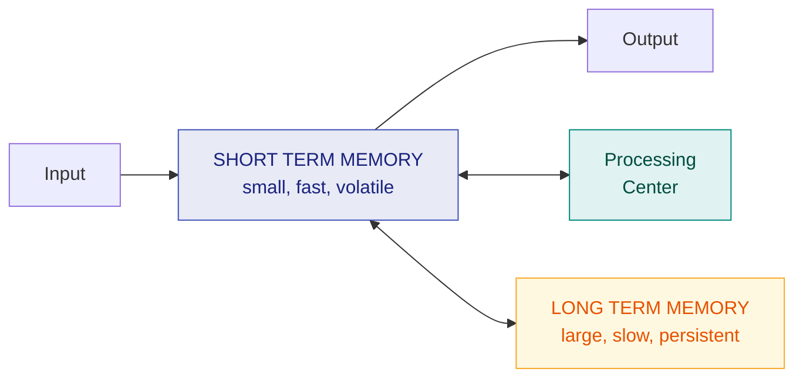
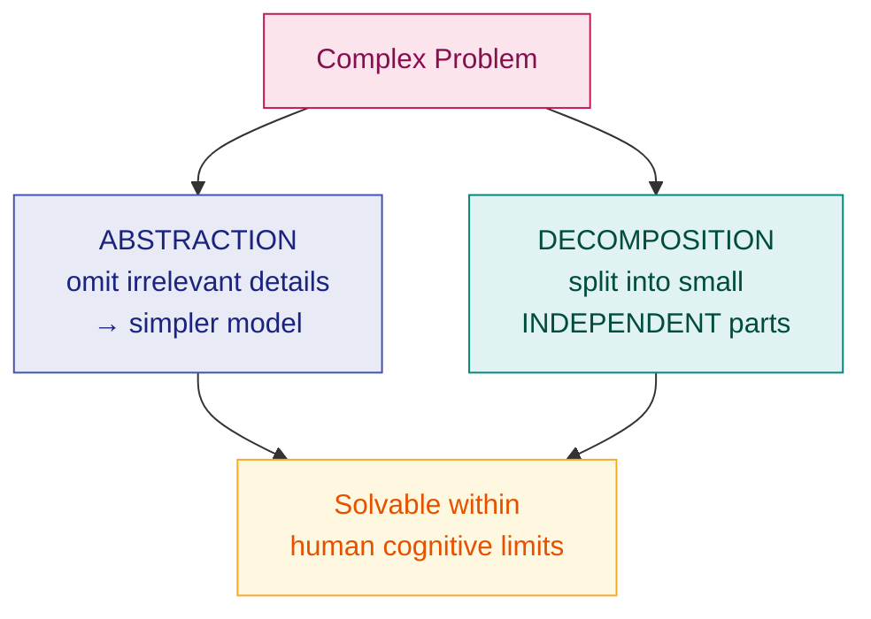

# 1. Introduction to Software Engineering

> **Lecture:** L1 (22-07-2026) · Dr. Prahlada Rao B B, CSE Department, NIT Manipur
> **Source:** `1.pdf`

---

## 🎯 In one line

Software engineering is the **systematic use of past experience and scientific principles** to build software — its techniques exist to overcome **human cognitive limitations**.

---

## 1. What is Software Engineering?

Software engineering is the **systematic collection of past experience** applied to software development:

- Techniques
- Methodologies
- Guidelines

It is often characterised as *"the practical application of scientific knowledge for the design and construction of computer programs, and the associated documentation required to develop, operate and maintain them."*

---

## 2. Engineering Practice ⭐

What makes any discipline "engineering"?

| Characteristic | Meaning |
|---|---|
| **Heavy use of past experience** | Past experience is **systematically arranged** — not rediscovered each time |
| **Theoretical basis and quantitative techniques** are provided | Measurement and models, not guesswork |
| **Many are just thumb rules** | Practical heuristics that work, even without full theory |
| **Trade-off between alternatives** | No single "right" answer — engineers balance competing goals |
| **Pragmatic approach to cost-effectiveness** | Good enough, on budget, on time |

---

## 3. Technology Development Pattern ⭐⭐

Every technology evolves through the same three stages:

```
  Technology
      ▲
      │                                    ╭──────  ENGINEERING
      │                                   ╱         Systematic use of past
      │                                  ╱          experience + scientific basis
      │                    ╭────────────╯
      │        CRAFT ─────╯
      │        Unorganized use
      │       ╱ of past experience
      │   ╭──╯
      │  ╱  ART
      │ ╱   Esoteric past experience
      └─────────────────────────────────────────► Time
```

| Stage | How knowledge is used |
|---|---|
| **Art** | **Esoteric** past experience — knowledge held by a few, passed on mysteriously |
| **Craft** | **Unorganized** use of past experience — apprenticeship, informal know-how |
| **Engineering** | **Systematic use of past experience and scientific basis** |

> ⭐ **Software engineering is the passage of software development from craft to engineering.** This diagram is a very common exam question — learn the three labels and the two descriptions attached to the transitions.

---

## 4. Human Cognition Mechanism ⭐

This is the *reason* software engineering principles work, and it is distinctive to this course — learn it.



### Short Term Memory — the bottleneck

An item stored in short-term memory **can get lost**:
- Either due to **decay with time**, or
- **Displacement by newer information**

This restricts the time for which an item is stored in short-term memory to **a few tens of seconds**. However, an item can be **retained longer by recycling** (rehearsal).

### Implication in Program Development ⭐

- A **small program** having just a few variables **is within the easy grasp of an individual**.
- As the number of **independent variables** in a program **increases**, it **quickly exceeds the grasping power** of an individual, and **requires large effort** to master the problem.

---

## 5. The Effort–Size Curve ⭐⭐

```
  Effort,
  Time,     │ Exploratory      Software
  Cost      │    ╱             Engineering        Machine
      ▲     │   ╱                    ╱          ╱
      │     │  ╱                   ╱         ╱
      │     │ ╱                  ╱       ╱
      │     │╱               ╱       ╱
      │     ╱           ╱      ╱
      │    ╱      ╱   ╱
      │  ╱╱  ╱ ╱
      └────────────────────────────────────────► Program Size
              Fig. 1.0  Effort–Size Curve
```

| Curve | Shape | Why |
|---|---|---|
| **Exploratory** (no SE) | **Steeply non-linear** — effort explodes as size grows | The programmer's cognitive limits are exceeded |
| **Software Engineering** | **Almost linear** | SE techniques extensively use techniques **to overcome human cognitive limitations** |
| **Machine** (a machine writing the program) | **Linear** | A machine has no cognitive limitation |

> ⭐ **The key sentence to reproduce in an exam:** *"The effort–size curve becomes almost linear when SE principles are deployed, because software engineering principles extensively use techniques to overcome human cognitive limitations."*

---

## 6. The two fundamental principles ⭐⭐

All software engineering techniques reduce to these two.

### 6.1 Abstraction

**Abstraction** means **simplifying a problem by omitting irrelevant details** and focusing only on the aspects that matter at the current level.

- It lets us understand a problem **without getting lost in detail**.
- Applied repeatedly, it produces a **hierarchy** of increasingly detailed models.

**Example:** a map. A road map omits buildings, trees and people — because for navigation they are irrelevant details.

### 6.2 Decomposition ⭐

**Decompose a problem into many small independent parts.**

- The small parts are then **taken up one by one and solved separately**.
- The idea is that each small part would be **easy to grasp** and can be **easily solved**.
- **The full problem is solved when all the parts are solved.**

**A popular way to demonstrate the decomposition principle:** try to break a bunch of sticks tied together, versus breaking them **individually**.

**Example of the decomposition principle:** you understand a book better when the contents are **organized into independent chapters**, compared to when everything is mixed up.

> ⚠️ **The word "independent" is essential.** Decomposing into parts that still depend heavily on one another gains nothing — you still have to hold all of it in your head at once. This is exactly why **low coupling** matters in design ([Ch. 6](06-software-design-fundamentals.md)).



---

## 7. Program vs Software Product ⭐

| | **Program** | **Software Product** |
|---|---|---|
| Author | Usually a **single** developer | A **team** of developers |
| User | The author **himself** | Mostly **other** people |
| Size | Small | Large |
| Structure | Lacks proper structure | **Well-structured**, modular |
| Documentation | Little or none | **Proper documentation** required |
| Development style | Ad hoc / **exploratory** | **Systematic**, follows a life cycle model |
| Maintenance | Not a concern | **Long-term** maintenance essential |
| User interface | May be absent | Carefully designed |

---

## 8. Exploratory style vs Modern Software Engineering

| **Exploratory (build-and-fix)** | **Modern SE practice** |
|---|---|
| Coding starts **immediately** after an informal understanding | A **life cycle model** is followed; coding is only one phase |
| Design is implicit, in the programmer's head | **Explicit design documents** produced |
| Effort grows **exponentially** with size | Effort grows **almost linearly** |
| Testing is ad hoc, at the end | **Systematic** testing at each phase |
| Very hard to maintain | Designed for maintainability |

> 📌 **Software crisis:** the exploratory style caused projects to be routinely **late, over budget, unreliable and unmaintainable**. Software engineering emerged as the response.

---

## 9. Common exam questions

1. **What is software engineering?** ⭐ → systematic collection of past experience: techniques, methodologies, guidelines.
2. **Explain the technology development pattern** (Art → Craft → Engineering) with a diagram. ⭐⭐
3. **What are the characteristics of engineering practice?** → the 5-row table.
4. **Explain the effort–size curve.** ⭐⭐ → exploratory (non-linear) vs SE (almost linear) vs machine (linear), and **why**.
5. **Explain the human cognition mechanism and its implication in program development.** ⭐ → short-term memory limits; effort explodes as independent variables increase.
6. **Explain abstraction and decomposition with examples.** ⭐⭐ → the bunch-of-sticks and book-chapters examples.
7. **Differentiate a program from a software product.** ⭐
8. **What is the exploratory style of software development? What are its drawbacks?**

---

## ⚡ Quick revision

- **Software engineering** = systematic collection of past experience — techniques, methodologies, guidelines.
- **Engineering practice:** past experience systematically arranged · theoretical basis + quantitative techniques · thumb rules · trade-offs · pragmatic cost-effectiveness.
- **Technology pattern: Art → Craft → Engineering.**
  - Art = **esoteric** past experience · Craft = **unorganized** use · Engineering = **systematic** use + scientific basis.
- **Short-term memory** loses items by **decay** or **displacement**, within **tens of seconds**; **recycling** retains them longer.
- As **independent variables** grow, the problem **exceeds an individual's grasping power**.
- **Effort–size curve:** Exploratory = steep/non-linear · **SE = almost linear** · Machine = linear.
- SE principles work because they **overcome human cognitive limitations**.
- **Two fundamental principles:**
  - **Abstraction** — omit irrelevant details, build a hierarchy of models.
  - **Decomposition** — split into small **independent** parts, solve each separately; the whole is solved when all parts are.
  - Decomposition demo: **a bunch of sticks** vs breaking them individually; **book chapters** vs mixed-up content.
- **Program** = one author, self-use, no structure/docs · **Software product** = team, other users, structured, documented, maintained.

---

**Next:** [2. Software Life Cycle Models →](02-software-life-cycle-models.md)
