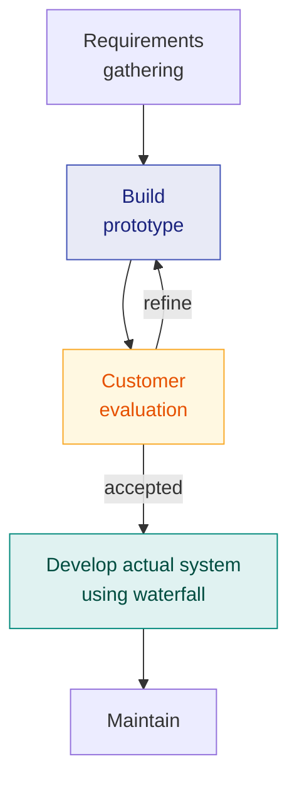

# 2. Software Life Cycle Models

> **Lecture:** L2 · **Source:** `pdf  L2-Life Cycle Models-Prahlad 2ppg.pdf`

---

## 🎯 In one line

A **software life cycle model** prescribes the series of identifiable stages a product passes through — Waterfall (rigid), Iterative Waterfall (with feedback), Prototyping (clarify requirements), Evolutionary (deliver in increments) and Spiral (risk-driven).

---

## 1. What is a software life cycle?

> **Software Life Cycle:** the **series of identifiable stages** that a software product undergoes during its lifetime.

A **life cycle model** describes those stages and the order in which they are carried out. Without one, developers work in an **exploratory (build-and-fix)** style — which fails as size grows ([Ch. 1](01-introduction-to-software-engineering.md)).

---

## 2. Classical Waterfall Model ⭐⭐

The classical waterfall model divides the life cycle into **six phases**:

```
   ┌──────────────────┐
   │ Feasibility Study│
   └────────┬─────────┘
            ▼
   ┌──────────────────────────────┐
   │ Requirements Analysis &      │
   │ Specification                │
   └────────┬─────────────────────┘
            ▼
      ┌──────────┐
      │  Design  │
      └────┬─────┘
           ▼
      ┌──────────────────────┐
      │ Coding & Unit Testing│
      └────┬─────────────────┘
           ▼
      ┌────────────────────────────┐
      │ Integration & System Testing│
      └────┬───────────────────────┘
           ▼
      ┌─────────────┐
      │ Maintenance │
      └─────────────┘
```

| # | Phase | Purpose |
|---|---|---|
| 1 | **Feasibility Study** | Determine whether the project is **financially and technically viable** |
| 2 | **Requirements Analysis and Specification** | Understand exactly what the customer wants; produce the **SRS document** |
| 3 | **Design** | Transform the SRS into a form implementable in a programming language |
| 4 | **Coding and Unit Testing** | Translate the design into code; test each module individually |
| 5 | **Integration and System Testing** | Integrate modules incrementally and test the whole system |
| 6 | **Maintenance** | Correct, improve and adapt the delivered product |

### Relative effort for phases ⭐⭐

This is a favourite exam question — learn both facts.

```
  Relative
  Effort (%)
     60 │                                        ███
     50 │                                        ███
     40 │                                        ███
     30 │                          ███           ███
     20 │            ███   ███     ███    ███    ███
     10 │  ███       ███   ███     ███    ███    ███
      0 └──┴───┴─────┴─────┴───────┴──────┴──────┴───
         Feas. Req.  Design Coding Testing   Maintenance
         └──────── DEVELOPMENT PHASES ───────┘
```

> ⭐ **Two facts to memorise:**
> 1. **Among ALL life cycle phases, the MAINTENANCE phase consumes the maximum effort.**
> 2. **Among the DEVELOPMENT phases, the TESTING phase consumes the maximum effort.**
>
> "Development phases" = the phases between feasibility study and testing.

### Organizational standards

Most organizations usually define:
- **Standards on outputs (deliverables)** produced at the end of every phase
- **Entry and exit criteria** for every phase

They also prescribe specific methodologies for specification, design, testing and project management. These guidelines and methodologies together are called the organization's **Software Development Methodology**. Fresh engineers are expected to master it.

---

## 3. Shortcomings of the Classical Waterfall Model ⭐⭐

> The classical waterfall model is an **idealistic** one — it **assumes that no defect is ever introduced during any of the life cycle phases**.

**In practice:**
- Defects **do** get introduced in almost every phase of the life cycle.
- Engineers **commit errors in every phase**. Reasons: **oversight, wrong assumptions, use of inappropriate technology, communication gap among engineers**, etc.
- These defects usually get **detected much later** in the life cycle. *For example, a design defect might go unnoticed until the coding or testing phase.*
- Once a defect is detected, we need to **go back to the phase where it was introduced** and **redo** some of the work done during that phase **and all subsequent phases**.

> ⚠️ **The classical waterfall has no feedback paths** — which is exactly why it cannot be used in practice. It is studied because every other model is derived from it.

---

## 4. Iterative Waterfall Model ⭐⭐

Once a defect is detected, we need to go back to the phase where it was introduced and redo some of the work done during that phase and all subsequent phases.

> **We need feedback paths in the classical waterfall model.**

```
   ┌──────────────────┐ ◄───────────┐
   │ Feasibility Study│             │
   └────────┬─────────┘             │
            ▼                       │
   ┌──────────────────┐ ◄─────────┐ │
   │ Req. Analysis    │           │ │  feedback
   └────────┬─────────┘           │ │  paths
            ▼                     │ │
      ┌──────────┐ ◄────────────┐ │ │
      │  Design  │              │ │ │
      └────┬─────┘              │ │ │
           ▼                    │ │ │
      ┌──────────┐ ◄──────────┐ │ │ │
      │  Coding  │            │ │ │ │
      └────┬─────┘            │ │ │ │
           ▼                  │ │ │ │
      ┌──────────┐────────────┴─┴─┴─┘
      │  Testing │
      └────┬─────┘
           ▼
      ┌─────────────┐
      │ Maintenance │
      └─────────────┘
```

Feedback paths allow returning from any phase to an earlier one when a defect is found.

> ⭐ **"The iterative waterfall model is by far the most widely used model. Almost every other model is derived from the waterfall model."** — this line is quotable and commonly asked.

**Phase containment of errors:** the principle that errors should be detected **in the same phase in which they are introduced**, since the cost of correction rises sharply the later a defect is found.

---

## 5. Prototyping Model ⭐

> **A working prototype of the system should first be built.**
> **A prototype is a "toy" implementation of a system.**

### Reasons for developing a prototype

1. To **illustrate input data formats, messages, reports and interactive dialogues** to the customer.
2. To examine **technical issues** associated with product development — for instance, to try out an unfamiliar algorithm or technology.
3. *(The third reason)* Because it is **impossible to "get it right" the first time** — one must plan to throw the first version away.

### How it works

A prototype is built using **several short-cuts** — inefficient, inaccurate or dummy functions may be used.

1. Build the prototype.
2. The developed prototype is **submitted to the customer for evaluation**.
3. Customer feedback is gathered and the prototype is **refined**.
4. The **actual system is developed using the classical waterfall approach**.



> 📌 **The final working prototype (with all user feedback incorporated) serves as an input to the actual development.** The **design and code for the prototype are usually thrown away** — however, the **experience gathered from developing the prototype helps a great deal** while developing the actual product.

**Cost:** even though construction of a working prototype involves **additional cost**, for systems with unclear requirements the **overall development cost is usually lower** — because it prevents building the wrong thing.

**Best for:** projects where requirements are **unclear**, the user interface is critical, or an **unfamiliar technology/algorithm** must be tried.

---

## 6. Evolutionary Model (Incremental / Successive Versions) ⭐

> Also known as **successive versions** or the **incremental model**.

The software is **incrementally implemented and delivered**. The system is broken into modules; a core set is delivered first, and further modules are added in successive versions.

```
   Version 1:  ┌───┐
               │ A │                          A = core module
               └───┘

   Version 2:  ┌───┬───┐
               │ A │ B │                      B added
               └───┴───┘

   Version 3:  ┌───┬───┬───┐
               │ A │ B │ C │                  C added — full product
               └───┴───┴───┘

   A, B, C are modules of the software product that are
   incrementally developed and delivered.
```

### Advantages ⭐

- **Users get a chance to experiment with a partially developed system** much before the full working version is released.
- Helps in **finding the exact user requirements** much before the fully working system is developed.
- **Core modules get tested thoroughly** — this **reduces the chances of errors** in the final product.

### Disadvantages ⭐

- Often **difficult to subdivide problems into functional units** that can be incrementally implemented and delivered.
- The evolutionary model is **useful for very large problems**, where it is easier to find modules for incremental implementation.

### Evolutionary Model with Iteration

Many organizations use a **combination of iterative and incremental development**. A new release may include **new functionality**, and **existing functionality from the current release may also have been modified**.

**Advantages:**
- **Training can start on an earlier release** — customer feedback is taken into account.
- **Markets can be created** for functionality that has never been offered before.
- **Frequent releases allow developers to fix unanticipated problems quickly.**

---

## 7. Spiral Model ⭐⭐

> **Proposed by Boehm in 1988.**

**Each loop of the spiral represents a phase of the software process:**
- The **innermost loop** might be concerned with **system feasibility**
- The **next loop** with **system requirements definition**
- The **next one** with **system design**, and so on

> 📌 **There are no fixed phases in this model** — the phases shown in a diagram are **just examples**.

### The four quadrants

```
                    │
     QUADRANT 1     │     QUADRANT 2
  Determine         │  Identify and
  objectives,       │  resolve RISKS
  alternatives,     │  (prototyping,
  constraints       │   analysis)
  ──────────────────┼──────────────────
     QUADRANT 4     │     QUADRANT 3
  Plan the next     │  Develop and
  phase             │  verify the
                    │  next-level product
                    │
      ↖ the spiral grows outward with each loop ↗
```

| Quadrant | Activity |
|---|---|
| **1** | Determine **objectives, alternatives and constraints** |
| **2** | **Identify and resolve risks** — evaluate alternatives |
| **3** | **Develop and verify** the next-level product |
| **4** | **Plan** the next phase / review |

> ⭐ **The defining feature of the spiral model is RISK.** It is the only classical model that makes **risk handling an explicit, mandatory activity** in every loop. If an exam asks "which model is best for high-risk projects?", the answer is **Spiral**.

| ✅ Advantages | ❌ Disadvantages |
|---|---|
| **Explicit risk management** at every stage | **Complex** to manage |
| Can accommodate other models within it (it is a **meta-model**) | Requires **risk-assessment expertise**, which is rare |
| Suits **large, expensive, complicated** projects | **Costly** for small projects |
| Software is produced early in the cycle | No fixed number of phases — hard to plan the end |

---

## 8. Comparison of all life cycle models ⭐⭐

| Model | Key idea | Handles changing requirements? | Risk handling | Best used when |
|---|---|---|---|---|
| **Classical Waterfall** | Linear, one pass, **no feedback** | ❌ No | ❌ None | Idealistic — **not usable in practice** |
| **Iterative Waterfall** | Waterfall + **feedback paths** | ⚠️ Limited | ⚠️ Low | Requirements are **well understood**. **Most widely used.** |
| **Prototyping** | Build a **toy implementation** first | ✅ Yes | ⚠️ Moderate | Requirements **unclear**; UI critical; unfamiliar technology |
| **Evolutionary / Incremental** | Deliver in **successive versions** | ✅ Yes | ⚠️ Moderate | **Very large** problems that split into modules |
| **Spiral** | **Risk-driven** loops, 4 quadrants | ✅ Yes | ✅ **Explicit** | **Large, expensive, high-risk** projects |

---

## 9. Types of maintenance ⭐

From the source, the maintenance phase involves three kinds of work:

| Type | Purpose |
|---|---|
| **Corrective** | **Correct errors** which were not discovered during the product development phases |
| **Perfective** | **Improve the implementation** of the system and **enhance the functionalities** of the system |
| **Adaptive** | **Port the software to a new environment** — e.g. to a new computer or a new operating system |

> 💡 **Memory hook:** **C**orrect bugs, **P**erfect features, **A**dapt to new environments.

---

## 10. Common exam questions

1. **What is a software life cycle? Why is a life cycle model needed?** ⭐
2. **Explain the classical waterfall model with a diagram.** ⭐⭐ → all six phases.
3. **Which phase consumes maximum effort?** ⭐⭐ → **Maintenance** overall; **Testing** among development phases.
4. **What are the shortcomings of the classical waterfall model?** ⭐⭐ → assumes no defects; defects detected late; no feedback paths.
5. **Explain the iterative waterfall model.** ⭐ → feedback paths; "most widely used model".
6. **Explain the prototyping model. Why develop a prototype?** ⭐ → the three reasons; prototype code is thrown away but experience is kept.
7. **Explain the evolutionary model with its advantages and disadvantages.** ⭐
8. **Explain the spiral model with its four quadrants.** ⭐⭐ → Boehm, 1988; risk-driven.
9. **Compare the different life cycle models.** ⭐⭐ → the comparison table.
10. **Explain the types of maintenance.** ⭐ → corrective, perfective, adaptive.

---

## ⚡ Quick revision

- **Life cycle** = series of identifiable stages a product undergoes.
- **Classical waterfall — 6 phases:** Feasibility Study → Requirements Analysis & Specification → Design → Coding & Unit Testing → Integration & System Testing → Maintenance.
- **Maximum effort:** **Maintenance** (all phases) · **Testing** (development phases only).
- **Classical waterfall is idealistic** — assumes **no defect is ever introduced**. In practice engineers err in every phase (oversight, wrong assumptions, inappropriate technology, communication gaps).
- **Iterative waterfall** adds **feedback paths**. *"By far the most widely used model; almost every other model is derived from the waterfall model."*
- **Prototyping:** a prototype is a **toy implementation** built with **short-cuts**. Three reasons: illustrate formats/dialogues · examine technical issues · you can't get it right first time. **Code is thrown away; experience is kept.**
- **Evolutionary / Incremental:** deliver in **successive versions**. ✅ users experiment early, exact requirements found, core modules well tested. ❌ hard to subdivide; suits **very large** problems.
- **Spiral (Boehm, 1988):** each loop = a phase; **no fixed phases**. Four quadrants: objectives → **risks** → develop & verify → plan. **Risk-driven** — best for large, high-risk projects.
- **Maintenance types:** **Corrective** (fix errors) · **Perfective** (improve/enhance) · **Adaptive** (new environment).

---

**Previous:** [← 1. Introduction](01-introduction-to-software-engineering.md) · **Next:** [3. Requirements Analysis & SRS →](03-requirements-analysis-and-srs.md)
