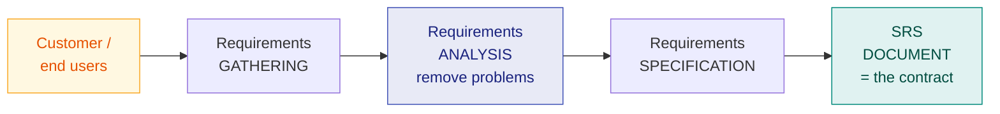

# 3. Requirements Analysis & Specification (SRS)

> **Lecture:** L3 (12-08-2026) · **Source:** `Lecture 3- Requirements Analysis and Specification -PDF.md`

---

## 🎯 In one line

Requirements Analysis & Specification is the life cycle phase that works out **exactly what the customer wants** and records it in the **SRS document** — the contract between customer and developer.

---

## 1. Why projects fail ⭐

> **Many projects fail because they start implementing the system without determining what the customer really wants.**

This is the opening argument of the lecture, and a common short-answer question. Building the wrong product correctly is still a failure.

---

## 2. The phase and its two activities ⭐

Requirements Analysis and Specification is an **important life cycle phase**. It **serves as a contract between the customer and the developers**.

It consists of **two distinct activities**:

| Activity | Purpose |
|---|---|
| **1. Requirements Gathering and Analysis** | Collect requirements from users/customers, then **remove inconsistencies, anomalies and incompleteness** |
| **2. Requirements Specification** | Systematically organise the gathered requirements into the **SRS document** |



---

## 3. Requirements Analysis — the three problems ⭐⭐

The analyst must **detect inconsistencies, ambiguities and incompleteness** in the gathered requirements, and **resolve them through further discussions with the end-users and the customers**.

| Problem | Meaning | Example |
|---|---|---|
| **Inconsistency** | Two requirements **contradict** each other | One user says a book can be issued for 30 days; another says 15 days |
| **Ambiguity** | A requirement can be interpreted in **more than one way** | "The system should respond **quickly**" — how quick? |
| **Incompleteness** | A required feature has been **left out** | Nobody mentioned what happens when a borrower loses a book |

> ⚠️ **Some anomalies and inconsistencies can be very subtle** and escape notice — which is why systematic analysis matters. **Many of the subtle anomalies and inconsistencies get detected** only through careful review and discussion.

**The goal:** remove **all** ambiguities, inconsistencies and anomalies from the initial customer perception of the problem.

---

## 4. The SRS Document ⭐⭐

The SRS document should be **written in a way the customer can understand**, and **at the same time should not be ambiguous**.

### The three important parts ⭐⭐

> **The SRS document contains three important parts:**
> 1. **Functional requirements**
> 2. **Non-functional requirements**
> 3. **Goals of implementation**

---

### 4.1 Functional Requirements

**Functional requirements describe *what* the system should do** — each function the system must perform.

Each functional requirement is described in terms of:
- The **input data** it accepts
- The **processing** carried out
- The **output data** produced

```
        ┌──────────────────────────────┐
  INPUT │         PROCESSING           │ OUTPUT
  ─────►│  (the function fᵢ)           │──────►
        └──────────────────────────────┘

  A function transforms a set of input data
  into a set of output data.
```

**Example:** *"The system shall allow a library member to issue a book. Input: member ID and book accession number. Processing: check the member's borrowing limit and the book's availability. Output: an issue receipt with the due date."*

---

### 4.2 Non-Functional Requirements ⭐

> **Characteristics of the system which cannot be expressed as functions.**

Non-functional requirements describe **how well** the system does what it does — its qualities and constraints.

**Non-functional requirements include:**
- **Reliability** issues
- **Accuracy** of results
- **Human–computer interface** issues
- **Performance** (response time, throughput)
- **Maintainability, portability, security, usability**
- Constraints on the **standards** to be followed, the **hardware/OS** to be used, etc.

### Functional vs Non-functional ⭐⭐

| | **Functional** | **Non-functional** |
|---|---|---|
| Describes | **What** the system does | **How well** it does it |
| Expressed as | **Functions** (input → processing → output) | **Characteristics / qualities** |
| Example | "Issue a book to a member" | "Response time must be under 2 seconds" |
| If not met | The system is **incomplete** | The system is **unusable / unacceptable** |

---

### 4.3 Goals of Implementation

**Suggestions** to the developers that are **not binding** — general directions the developer may follow if convenient. They may deal with issues such as revisions to the system functionalities that may be required in the future, new devices to be supported, or reusability issues.

> ⭐ **The key distinction:** functional and non-functional requirements are **binding** — the system must satisfy them. **Goals of implementation are NOT binding** — they are merely suggestions. Exams test this difference directly.

---

## 5. Organization of the SRS Document ⭐

| Section | Contents |
|---|---|
| **1. Introduction** | Purpose, scope, definitions, overview of the product |
| **2. Functional Requirements** | The complete list of all functions the system performs |
| **3. Non-functional Requirements** | Including **external interface requirements**, performance, reliability, security |
| **4. Goals of Implementation** | Non-binding suggestions to the developers |

---

## 6. Characteristics of a good SRS document ⭐⭐

| Characteristic | Meaning |
|---|---|
| **Concise** | Short and clear, without unnecessary detail |
| **Unambiguous** | Exactly **one** interpretation possible |
| **Complete** | Every required feature is present |
| **Consistent** | No requirement contradicts another |
| **Verifiable** | Each requirement can be **tested** to see whether it is met |
| **Traceable** | Each requirement can be traced to a design element, code and test case |
| **Modifiable** | Structured so that changes can be made without side-effects |
| **Structured** | Well organised — easy to navigate |

---

## 7. Characteristics of a BAD SRS document ⭐⭐

The lecture names **three** specific faults. Learn these exact three — they are a standard question.

| Fault | Meaning | Example from the lecture |
|---|---|---|
| **Ambiguity** | **Literary expressions** and **unquantifiable aspects** | *"good user interface"* — how is "good" measured? |
| **Forward References** | References to aspects of the problem that are **defined only later on in the text** | Section 2 uses a term first defined in Section 7 |
| **Wishful Thinking** | Descriptions of aspects **for which realistic solutions will be hard to find** | "The system shall never fail" |

Other consequences of a poor SRS: **no basis for the contract**, no basis for **testing**, disputes between customer and developer, and difficulty in estimating cost and schedule.

---

## 8. Representation techniques for complex logic

When requirements involve complicated **conditional logic**, plain prose becomes ambiguous. The lecture introduces two structured techniques:

- **Decision Trees**
- **Decision Tables**

These get their own chapter → [Ch. 4](04-decision-tables-and-trees.md).

---

## 9. Common exam questions

1. **Why do many projects fail?** ⭐ → they start implementing without determining what the customer really wants.
2. **What are the two activities of the requirements analysis and specification phase?** ⭐ → gathering & analysis, and specification.
3. **What problems does requirements analysis aim to remove?** ⭐⭐ → **inconsistency, ambiguity, incompleteness** (define each with an example).
4. **What are the three parts of an SRS document?** ⭐⭐ → functional, non-functional, goals of implementation.
5. **Differentiate functional and non-functional requirements** with examples. ⭐⭐
6. **What are goals of implementation? How do they differ from requirements?** ⭐ → **not binding**, only suggestions.
7. **State the characteristics of a good SRS document.** ⭐⭐
8. **State the characteristics of a BAD SRS document.** ⭐⭐ → **Ambiguity, Forward References, Wishful Thinking.**
9. **Explain the organization of an SRS document.**
9. **Why is the SRS document called a contract?** → it is agreed between customer and developer and forms the basis for acceptance.

---

## ⚡ Quick revision

- **Projects fail** because they start implementing **without determining what the customer really wants**.
- The phase **serves as a contract between the customer and the developers**.
- **Two activities:** (1) Requirements **Gathering and Analysis**, (2) Requirements **Specification**.
- Analysis removes **Inconsistency** (contradiction), **Ambiguity** (multiple interpretations), **Incompleteness** (missing features) — resolved through **further discussions with end-users and customers**.
- **SRS has THREE parts:** **Functional requirements · Non-functional requirements · Goals of implementation.**
- **Functional** = what the system does, as **input → processing → output**.
- **Non-functional** = characteristics that **cannot be expressed as functions**: reliability, accuracy, human–computer interface, performance, maintainability, portability, security.
- **Goals of implementation are NOT binding** — only suggestions to developers.
- **Good SRS:** concise, unambiguous, complete, consistent, verifiable, traceable, modifiable, structured.
- **Bad SRS — three faults:** **Ambiguity** (literary expressions, unquantifiable aspects like *"good user interface"*) · **Forward References** (defined only later in the text) · **Wishful Thinking** (no realistic solution exists).
- Complex conditional logic → use **decision trees and decision tables**.

---

**Previous:** [← 2. Life Cycle Models](02-software-life-cycle-models.md) · **Next:** [4. Decision Tables & Trees →](04-decision-tables-and-trees.md)
