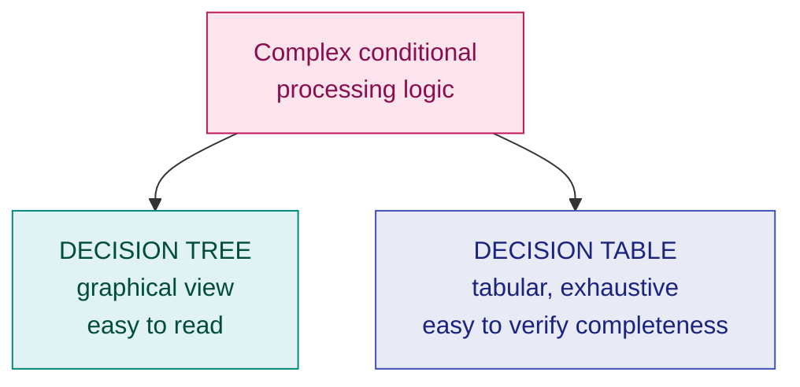
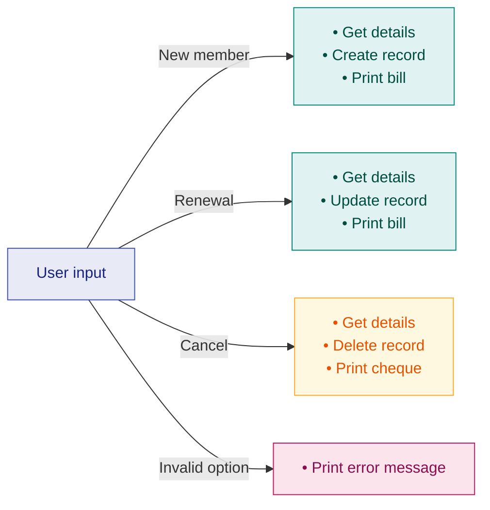

# 4. Decision Tables & Decision Trees

> **Lecture:** L3 (12-08-2026) · **Source:** `Lecture 3- Requirements Analysis and Specification -PDF.md`

---

## 🎯 In one line

When requirements involve **complex conditional logic**, prose becomes ambiguous — **decision trees** show the logic graphically, **decision tables** show every condition-combination exhaustively.

---

## 1. Why they exist

Natural language is a poor way to express requirements like *"if the member is valid and the option is renewal, then update the expiry date and print the bill, otherwise…"*. Nested conditions quickly become **ambiguous and error-prone**.

**Representation of Complex Processing Logic** uses two techniques:

- **Decision Trees**
- **Decision Tables**



---

## 2. Decision Tree ⭐

> **Edges of a decision tree represent conditions.**
> **Leaf nodes represent actions to be performed.**
>
> A decision tree gives a **graphic view** of the **logic involved in decision making** and the **corresponding actions taken**.

```
          ┌── edge = CONDITION ──► [leaf = ACTIONS]
  (root)──┤
          └── edge = CONDITION ──► [leaf = ACTIONS]
```

---

## 3. The Library Membership Software (LMS) example ⭐⭐

This is the lecture's worked example. Learn it — it is the most likely exam question in this chapter.

### Problem statement

A **Library Membership automation Software (LMS)** should support the following **three options**: **New member**, **Renewal**, **Cancel membership**.

**When the New member option is selected:**
- The software asks details about the member: **name, address, phone number**, etc.
- If proper information is entered:
  - A **membership record** for the member is **created**
  - A **bill is printed** for the annual membership charge plus the security deposit payable

**If the Renewal option is chosen:**
- LMS asks the member's **name and membership number**, and checks whether he is a **valid member**
- If the name represents a **valid member**:
  - The **membership expiry date is updated**
  - The **annual membership bill is printed**
- **Otherwise an error message is displayed**

**If the Cancel Membership option is selected** and the name of a **valid member** is entered:
- The **membership is cancelled**
- A **cheque for the balance amount** due to the member is printed
- The **membership record is deleted**

---

### 3.1 Decision Tree for LMS ⭐⭐

```
                              ┌─── New member ────►  • Get details
                              │                      • Create record
                              │                      • Print bill
                              │
                              ├─── Renewal ───────►  • Get details
   User ──────────────────────┤                      • Update record
   input                      │                      • Print bill
                              │
                              ├─── Cancel ────────►  • Get details
                              │                      • Delete record
                              │                      • Print cheque
                              │
                              └─── Invalid option ►  • Print error message

                   Fig. 3.4: Decision tree for LMS
```

**How to read it:** each **edge** is a condition (which option the user selected); each **leaf** lists the **actions** performed for that condition.

Rendered as a flow:



---

## 4. Decision Table ⭐⭐

A **decision table** specifies the same logic in a **tabular form**. It has **four quadrants**:

```
   ┌────────────────────┬──────────────────────┐
   │  CONDITION STUB    │   CONDITION ENTRIES  │   ← the conditions
   │  (list of          │   (Y / N / —)        │      and their values
   │   conditions)      │                      │
   ├────────────────────┼──────────────────────┤
   │  ACTION STUB       │   ACTION ENTRIES     │   ← the actions and
   │  (list of actions) │   (× = perform)      │      whether performed
   └────────────────────┴──────────────────────┘
          ↑ what                ↑ each column = one RULE
```

| Quadrant | Contents |
|---|---|
| **Condition stub** | The list of conditions to be checked |
| **Condition entries** | The value of each condition for each rule (**Y**, **N**, or **—** for "don't care") |
| **Action stub** | The list of all possible actions |
| **Action entries** | A **×** marks each action performed for that rule |

Each **column** is a **rule** — one distinct combination of conditions and the actions it triggers.

---

### 4.1 Decision Table for LMS ⭐⭐

| **Conditions** | R1 | R2 | R3 | R4 |
|---|:---:|:---:|:---:|:---:|
| Valid selection | **N** | Y | Y | Y |
| New member | — | **Y** | N | N |
| Renewal | — | N | **Y** | N |
| Cancellation | — | N | N | **Y** |
| **Actions** | | | | |
| Display error message | **×** | | | |
| Ask for member's details | | **×** | | |
| Build customer record | | **×** | | |
| Generate bill | | **×** | **×** | |
| Ask member's name & membership number | | | **×** | **×** |
| Update expiry date | | | **×** | |
| Print cheque | | | | **×** |
| Delete record | | | | **×** |

**Reading rule R3 (Renewal):** the selection is valid, it is not a new member, it *is* a renewal, not a cancellation → therefore **ask the member's name and membership number**, **update the expiry date**, and **generate the bill**.

> 💡 **The "—" (don't care) in R1 matters.** When the selection is invalid, it is irrelevant which of the three options was attempted — only the error message is printed. Using "—" collapses what would otherwise be several redundant columns into one.

---

## 5. Decision Tree vs Decision Table ⭐⭐

| Feature | **Decision Tree** | **Decision Table** |
|---|---|---|
| Form | **Graphical** (tree) | **Tabular** (matrix) |
| Edges / columns represent | Edges = **conditions** | Columns = **rules** |
| Leaves / rows | Leaves = **actions** | Rows = conditions and actions |
| **Easy to understand?** | ✅ **Yes** — very intuitive, good for customers | ⚠️ Less intuitive at first glance |
| **Checking completeness** | ❌ Hard — easy to miss a branch | ✅ **Easy** — every combination appears as a column |
| Sequence of decisions | ✅ **Shown clearly** (order of branching) | ❌ Not shown |
| Large number of conditions | ❌ Tree becomes **huge and unwieldy** | ✅ Handles them **compactly** |
| Best for | **Explaining** logic to a customer | **Verifying** that no case is missed |

> ⭐ **The one-line answer examiners want:** a **decision tree is easier to understand**, but a **decision table is better for checking completeness and consistency** — because with $n$ conditions, the table makes all $2^n$ combinations explicit.

---

## 6. How to construct them — a method

### Decision tree
1. Identify the **conditions** from the problem statement.
2. Start from a root representing the input/decision point.
3. Draw one **edge per condition outcome**.
4. At each **leaf**, list **all** actions performed for that path.
5. **Don't forget the error/invalid branch** — it is a common lost mark.

### Decision table
1. List all **conditions** in the condition stub.
2. List all **actions** in the action stub.
3. Work out the number of rules: $2^n$ for $n$ binary conditions (fewer if "don't care" collapses some).
4. Fill in the **condition entries** — one column per rule.
5. Mark **×** for each action triggered by that rule.
6. **Simplify** by merging columns that produce identical actions, using "—".

---

## 7. Worked practice example

**Problem:** A bank sanctions a loan under these rules. If the applicant's credit score is good **and** income is above ₹50,000, sanction the loan at a low interest rate. If the credit score is good but income is ₹50,000 or below, sanction at a high rate. If the credit score is poor, reject the application.

### Decision tree

```
                    ┌── Credit good ──┬── Income > 50k ──► • Sanction loan
                    │                 │                     • Apply LOW rate
   Loan             │                 │
   application ─────┤                 └── Income ≤ 50k ──► • Sanction loan
                    │                                       • Apply HIGH rate
                    │
                    └── Credit poor ─────────────────────► • Reject application
```

### Decision table

| **Conditions** | R1 | R2 | R3 |
|---|:---:|:---:|:---:|
| Credit score good | Y | Y | **N** |
| Income > ₹50,000 | **Y** | **N** | — |
| **Actions** | | | |
| Sanction loan | × | × | |
| Apply low interest rate | × | | |
| Apply high interest rate | | × | |
| Reject application | | | × |

Note how **"—"** in R3 captures that income is irrelevant once the credit score is poor.

---

## 8. Common exam questions

1. **What are decision trees and decision tables? Why are they used?** ⭐ → to represent **complex processing logic** unambiguously.
2. **In a decision tree, what do edges and leaf nodes represent?** ⭐⭐ → **edges = conditions, leaf nodes = actions**.
3. **Draw the decision tree for the Library Membership Software.** ⭐⭐
4. **Draw the decision table for the Library Membership Software.** ⭐⭐
5. **Explain the four quadrants of a decision table.** ⭐ → condition stub, condition entries, action stub, action entries.
6. **Compare decision trees and decision tables.** ⭐⭐ → tree is easier to understand; table is better for completeness.
7. **Given a problem statement, construct a decision tree and a decision table.** ⭐⭐ *(the most likely form of the question)*

---

## ⚡ Quick revision

- Both represent **complex processing logic** that prose would make ambiguous.
- **Decision tree:** **edges = conditions**, **leaf nodes = actions**. Gives a **graphic view** of the decision logic and corresponding actions.
- **Decision table — four quadrants:** condition stub · condition entries · action stub · action entries. **Each column = one rule.**
- **Y / N / —** in condition entries; **×** marks actions performed. **"—" = don't care**, and it collapses redundant columns.
- With $n$ binary conditions there are up to $2^n$ rules.
- **Tree = easier to understand and shows the sequence** of decisions.
- **Table = easier to check completeness and consistency**, and scales better with many conditions.
- **LMS example — three options:** New member (get details, create record, print bill) · Renewal (get details, update record, print bill) · Cancel (get details, delete record, print cheque) · **Invalid option → print error message**.
- ⚠️ Always include the **invalid/error branch** — it is the most commonly forgotten case.

---

**Previous:** [← 3. Requirements & SRS](03-requirements-analysis-and-srs.md) · **Next:** [5. Formal Specification →](05-formal-specification-of-systems.md)
