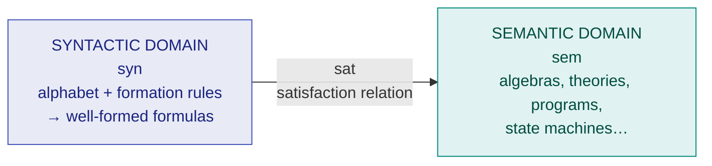

# 5. Formal Specification of Systems

> **Lecture:** L4 (18-08-2026) · **Source:** `Lecture 4- Formal Specification of Systems 2pg  pdf.md`

---

## 🎯 In one line

A **formal technique** specifies a system using a **mathematically-based specification language**, removing the ambiguity of natural language — at the cost of being difficult to learn and unable to scale to complex problems.

---

## 1. What is a Formal Technique?

A **formal technique** is a mathematical method used to specify a **hardware and/or software system**, verify whether a specification is realisable, verify that an implementation satisfies its specification, prove properties of a system without necessarily running it, and so on.

> **Formal techniques can be used at every stage of the system development activity.**

### The specification–implementation hierarchy ⭐

```
   ┌─────────────────────────┐
   │ Requirements            │  ← Specification of Design
   │ Specification           │
   └───────────┬─────────────┘
               ▼
   ┌─────────────────────────┐  ← Implementation of Requirements
   │ Design                  │  ← Specification of Coding
   └───────────┬─────────────┘
               ▼
   ┌─────────────────────────┐  ← Implementation of Design
   │ Coding                  │  ← Specification of Testing
   └───────────┬─────────────┘
               ▼
   ┌─────────────────────────┐  ← Implementation of Coding
   │ Testing                 │
   └─────────────────────────┘
```

> ⭐ **The key insight:** **each stage in this hierarchy is an implementation of its preceding stage and a specification of the succeeding stage.** This sentence is directly quotable and frequently asked.

---

## 2. Formal Specification Language ⭐⭐

> The mathematical basis of a formal method is provided by its **specification language**.

A **Formal Specification Language** consists of **two sets** and **a relation** between them:

$$\text{Formal Specification Language} = \langle \text{syn},\ \text{sem},\ \text{sat} \rangle$$

| Component | Name | Meaning |
|---|---|---|
| **syn** | **Syntactic domain** | The notation you write in |
| **sem** | **Semantic domain** | The things being described |
| **sat** | **Satisfaction relation** | Which notation describes which thing |

For a given specification $\text{syn}$ and model of the system $\text{sem}$, if $\textbf{sat(syn, sem)}$, then:
- **syn is the specification of sem**, and
- **sem is the specificand of syn**



### 2.1 Syntactic Domain

The syntactic domain of a formal specification language consists of:
- An **alphabet of symbols**
- A **set of formation rules** to construct **well-formed formulas** from the alphabet

The **well-formed formulas are used to specify a system**.

### 2.2 Semantic Domain

The semantic domain depends on what kind of language it is:

| Language type | Specifies |
|---|---|
| **Abstract Data Type specification languages** | **Algebras, theories, and programs** |
| **Programming languages** | **Functions from input to output values** |
| **Concurrent and Distributed System specification languages** | **State sequences, event sequences, state-transition sequences, synchronization trees, partial orders, state machines**, etc. |

### 2.3 Satisfaction Relation

Given the model of a system, it is important to determine **whether an element of the semantic domain satisfies the specification**.

- This satisfaction is determined using a **homomorphism** known as the **Semantic Abstraction Function**.
- The Semantic Abstraction Function **maps the elements of the semantic domain into equivalence classes**.
- There can be **different specifications describing different aspects** of a system model, possibly using **different specification languages**. Some describe the system's **behaviour**, others its **structure**.

> ⭐ **Two broad classes of Semantic Abstraction Functions are defined:**
> 1. Those that **preserve a system's behaviour**
> 2. Those that **preserve a system's structure**

---

## 3. Model-Oriented vs Property-Oriented ⭐⭐

> **Formal methods are usually classified into two broad categories:** Model-oriented approach and Property-oriented approach.

### Model-Oriented Style

In a **Model-Oriented Style** one defines system behaviour **directly** by **constructing a model of the system**, in terms of mathematical structures such as:
- **Tuples, relations, functions, sets, sequences**
- Also **state machines, Petri nets**, etc.

> 📌 In the model-oriented approach **we specify a program by writing another, simpler program.**

**Popular model-oriented specification techniques:** **Z** (the Z notation) — used to specify system states, state sequences, operations on those states, pre- and post-conditions, etc. — and **VDM**.

### Property-Oriented Style

In a **Property-Oriented Style** one defines system behaviour **indirectly** by **stating its properties**, usually in the form of a **set of axioms that the system must satisfy**.

**Examples:** logic-based, **algebraic specification**, etc.

### Comparison ⭐⭐

| | **Model-Oriented** | **Property-Oriented** |
|---|---|---|
| Defines behaviour | **Directly**, by constructing a model | **Indirectly**, by stating properties |
| Uses | Tuples, relations, functions, sets, sequences, state machines, Petri nets | A **set of axioms** the system must satisfy |
| Examples | **Z, VDM** | **Logic-based, algebraic specification** |
| Ease of change | Harder to change | ✅ **Easily changed** |
| Best suited to | **Later phases** of the life cycle | ✅ **Requirements specification** |

> ⭐ **The reason for the suitability split:**
> - **Property-oriented approaches are suitable for requirements specification because they can be easily changed** — and requirements change constantly.
> - **Model-oriented approaches are more suited to later phases of the life cycle**, where the design is settling down and a concrete model is what you need.

---

## 4. Example — the Producer/Consumer System ⭐

This is the lecture's worked contrast between the two styles.

### Property-Oriented Style

We **list the properties** of the system:
- The **consumer can start consuming only after the producer has produced an item**
- The **producer starts to produce an item only after the consumer has consumed the last item**

$$\text{Producing} \implies \text{No items exist for consumption}$$
$$\text{Consuming} \implies \text{Item exists for consumption}$$

We define the basic operations **p (produce)** and **c (consume)**, and then state axioms constraining their allowed sequences.

### Model-Oriented Style

Instead of listing properties, we would **construct a model** — for example a **state machine** with states "empty" and "full", and transitions labelled $p$ and $c$:

```
              p (produce)
        ┌─────────────────►┐
   ┌────────┐          ┌────────┐
   │ EMPTY  │          │  FULL  │
   └────────┘          └────────┘
        ◄─────────────────┘
              c (consume)
```

The behaviour is now defined **directly by the model** rather than indirectly by axioms.

---

## 5. Operational Semantics ⭐

> **The operational semantics of a formal method is the way the computations are represented.**

There are **different types of operational semantics**, according to what is meant by a **single run of the system** and how the **runs are grouped together** to describe the behaviour of the system.

**Some commonly used operational semantics:**

| Semantics | Meaning |
|---|---|
| **Linear semantics** | A run is described by a **sequence of events/states**; non-determinism is not explicitly represented |
| **Branching semantics** | The behaviour is a **tree** — the branching structure of the computation is explicitly represented |
| **Maximal parallelism semantics** | Concurrent events are assumed to happen **simultaneously** whenever possible |
| **Partial order semantics** | Events are only **partially ordered** — independent events need no relative order |

---

## 6. Merits of Formal Methods ⭐⭐

| # | Merit |
|---|---|
| 1 | **Facilitates precise formulation of specifications.** The construction of a rigorous specification **clarifies several aspects of system behaviour which are not obvious in an informal specification**. |
| 2 | **Cost-effective.** It is cost-effective to spend more effort at the specification stage — otherwise **many flaws that go unnoticed will appear at later stages** of development. For large complex systems like real-time systems, **80% of project costs and most cost overruns result from iterative changes required due to improper requirements specification**. |
| 3 | **Well-founded mathematical basis.** Formal specifications are **precise** and can be used to **mathematically reason about the properties** of a specification. |
| 4 | **Well-defined semantics.** **Ambiguity in specifications is automatically avoided** when one formally specifies a system. (Even carefully written informal specifications are **prone to ambiguity and error**, and cannot serve as a basis of verification.) |
| 5 | **Scope for automation.** The mathematical basis gives scope for **automating the analysis** of specifications. **Automatic verification is one of the most important advantages of formal methods.** |
| 6 | **Executable specifications.** Formal specifications can be **executed**, providing **immediate feedback** on features of the specified system. The concept of executable specification is related to **rapid prototyping**. |

> 💡 **The process point worth quoting:** *"the process of developing a rigorous specification is often more important than the specification itself"* — the act of formalising forces you to confront questions you would otherwise leave vague.

---

## 7. Limitations of Formal Methods ⭐⭐

| # | Limitation |
|---|---|
| 1 | **Difficult to learn and use.** |
| 2 | **Loss of overall perspective.** While using formal specifications, engineers **tend to lose the overall perspective and get lost in the details**. |
| 3 | **Gödel's incompleteness.** The basic incompleteness results of first-order logic (**Gödel**) suggest that it is **impossible to check the absolute correctness of systems using theorem-proving techniques**. |
| 4 | **Cannot handle complex problems.** Even **moderately complicated problems blow up the complexity** of formal specification and their analysis. Also, a **large unstructured set of mathematical formulas is difficult to understand**. |

---

## 8. Formal vs Informal Specification Methods ⭐

> **Formal specifications do not replace informal descriptions — they complement them.**

- The **comprehensibility of formal specifications is greatly enhanced when accompanied by an informal description**.
- **General recommendation: a mixed approach** — use formal techniques as a **broad guideline for the use of informal techniques**.

---

## 9. Axiomatic and Algebraic Specification

| Technique | Idea |
|---|---|
| **Axiomatic specification** | Specify a function by **pre-conditions and post-conditions** expressed in first-order logic. The pre-condition states what must hold before the operation; the post-condition states what holds after. |
| **Algebraic specification** | Specify an object/data type by defining its **operations (signatures)** and the **axioms (equations)** that relate them — without any model of the internal state. This is a **property-oriented** technique. |

**Executable specifications and 4GL:** a specification that can be **directly executed** gives immediate feedback and links to **rapid prototyping**; **fourth-generation languages (4GLs)** are a practical instance of this idea.

---

## 10. Common exam questions

1. **What is a formal technique? At which stages can it be used?** ⭐
2. **Explain the specification–implementation hierarchy.** ⭐⭐ → *each stage is an implementation of its preceding stage and a specification of the succeeding stage.*
3. **What is a formal specification language? Explain syn, sem and sat.** ⭐⭐
4. **What is the syntactic domain / semantic domain / satisfaction relation?** ⭐
5. **What is the Semantic Abstraction Function? Name its two broad classes.** ⭐ → preserve behaviour, preserve structure.
6. **Differentiate model-oriented and property-oriented approaches.** ⭐⭐ → with examples (Z/VDM vs logic-based/algebraic) and which suits which life cycle phase.
7. **Explain the producer/consumer example in both styles.** ⭐
8. **What is operational semantics? Name its types.**
9. **State the merits and limitations of formal methods.** ⭐⭐
10. **Do formal methods replace informal descriptions?** ⭐ → **No — they complement them**; use a mixed approach.

---

## ⚡ Quick revision

- **Formal technique** = mathematical method to specify and verify a system. Usable at **every stage** of development.
- **Each stage is an implementation of the preceding stage and a specification of the succeeding stage.**
- **Formal Specification Language = ⟨syn, sem, sat⟩:** syntactic domain, semantic domain, satisfaction relation.
  - **syn** = alphabet + formation rules → **well-formed formulas**
  - **sem** = algebras/theories/programs, functions input→output, state machines, event sequences…
  - **sat(syn, sem)** ⇒ syn is the **specification**, sem is the **specificand**
- **Semantic Abstraction Function** = a **homomorphism** mapping the semantic domain into **equivalence classes**. Two classes: preserve **behaviour**, preserve **structure**.
- **Model-oriented:** define behaviour **directly** via a model (tuples, sets, functions, state machines, Petri nets). Examples: **Z, VDM**. Suits **later life cycle phases**.
- **Property-oriented:** define behaviour **indirectly** via a **set of axioms**. Examples: **logic-based, algebraic**. Suits **requirements specification** because it is **easily changed**.
- **Producer/Consumer:** property style lists axioms about $p$ and $c$; model style builds a state machine.
- **Merits:** precise · cost-effective (80% of real-time project costs come from bad requirements) · mathematical basis · no ambiguity · **automatic verification** · **executable specifications → rapid prototyping**.
- **Limitations:** hard to learn · engineers **lose overall perspective** · **Gödel** ⇒ absolute correctness uncheckable · **cannot handle complex problems**.
- **Formal specifications complement, not replace, informal ones — use a mixed approach.**

---

**Previous:** [← 4. Decision Tables & Trees](04-decision-tables-and-trees.md) · **Next:** [6. Software Design Fundamentals →](06-software-design-fundamentals.md)
