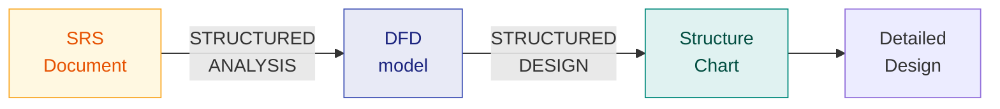

# 7. Function-Oriented Software Design

> **Lecture:** L7 (09-09-2026) · **Source:** `Lecture 7 Function Oriented Design-Prahlad-NIT-CS3501.md`
> **Continued in [Ch. 8](08-structured-design-examples-and-structure-charts.md)** (L7b, 15–18-09-2026): the TAS example, DFD guidelines and common errors, DFD shortcomings, and full structure-chart and transform/transaction-analysis examples.

---

## 🎯 In one line

**Structured Analysis** transforms the SRS into a **DFD**; **Structured Design** transforms the DFD into a **Structure Chart**.

---

## 1. The SA/SD methodology ⭐⭐

Function-oriented design techniques are **very popular** and currently in use in many software development organizations. The most widely used is **Structured Analysis / Structured Design (SA/SD)**.



> - **During Structured Analysis:** the **SRS document is transformed into a DFD**.
> - **During Structured Design:** the **DFD model is transformed into a Structure Chart**.

| Phase | Input | Output | Question it answers |
|---|---|---|---|
| **Structured Analysis** | SRS document | **DFD** | **What** does the system do? |
| **Structured Design** | DFD | **Structure Chart** | **How** is it organised into modules? |

---

## 2. Structured Analysis

> Structured Analysis **transforms a textual problem description into a Graphic Model**, done using **Data Flow Diagrams (DFDs)**. DFDs **graphically represent the results of Structured Analysis**.

It is based on the principles of **top-down decomposition** and **divide and conquer** — the high-level functions are successively decomposed into more detailed sub-functions.

---

## 3. Data Flow Diagrams (DFDs) ⭐⭐

> A DFD is an **elegant modelling technique**, useful not only to represent the results of Structured Analysis. The **DFD technique is very popular — it is powerful and yet simple to understand and use**.
>
> **A DFD is a hierarchical graphical model** of a system that shows the different processing activities and the data flow among them.

### 3.1 Primitive symbols ⭐⭐

> **Primitive symbols are used for constructing DFDs:** External entity, Process, Data Flow, Data Store, Output.

```
   ┌─────────────┐        ╭──────────╮
   │  External   │        │ search-  │        ─────────►
   │   entity    │        │   book   │        Data Flow
   │ (rectangle) │        ╰──────────╯        (directed arc)
   └─────────────┘     Process / bubble
                       / transform (circle)

   ═══════════════
    Data Store            ┌──────────┐
   ═══════════════        │  Output  │
   (two parallel lines)   └──────────┘
```

| Symbol | Shape | Represents |
|---|---|---|
| **Process / bubble / transform** | **Circle** | A **function** such as `search-book`. Bubbles are **annotated with the corresponding function names**. Functions represent some activity, so **function names should be verbs**. |
| **External entity** | **Rectangle** | Real physical entities **external to the software system** that interact with it by **inputting data to the system** or **consuming data produced by the system**. Besides human users, it can represent **external hardware or external software** such as another application. **Sometimes called terminator, source or sink.** |
| **Data flow** | **Directed arc (arrow)** | Data flow occurring **between two processes, or between a process and an external entity**, in the direction of the arrow. |
| **Data store** | **Two parallel lines** | A **repository of data** — a file or database the system reads from or writes to. |
| **Output** | **Rectangle/box** | Data output from the system. |

> ⚠️ **Common exam mistakes:** naming bubbles with nouns (they must be **verbs**), and drawing a data flow directly between two **external entities** (not allowed — data must pass through a process).

---

## 4. The DFD hierarchy ⭐⭐

A DFD is **hierarchical** — it is developed as a series of levels, each more detailed than the last.

```
   LEVEL 0 (Context Diagram)
   ┌──────────┐            ╭─────────────╮            ┌──────────┐
   │ Librarian│───────────►│   Library    │──────────►│  Member  │
   └──────────┘            │Automation Sys│            └──────────┘
                           ╰─────────────╯
        ONE bubble = the whole system
                    │
                    ▼  decompose (explode / factor)
   LEVEL 1
        ╭──────╮      ╭──────╮      ╭──────╮
        │ 1.0  │      │ 2.0  │      │ 3.0  │      3 to 7 bubbles
        │issue │      │return│      │query │
        ╰──────╯      ╰──────╯      ╰──────╯
                    │
                    ▼  decompose further
   LEVEL 2
        ╭──────╮ ╭──────╮ ╭──────╮
        │ 1.1  │ │ 1.2  │ │ 1.3  │
        ╰──────╯ ╰──────╯ ╰──────╯
```

### 4.1 Context Diagram (Level-0 DFD) ⭐⭐

> The **context diagram captures**:
> - The **various entities external to the system** and interacting with it
> - The **data flow occurring between the system and the external entities**
>
> **The context diagram is also called the level-0 DFD.**
>
> It **establishes the context of the system** — it represents the **data sources** and **data sinks**.

The whole system appears as a **single bubble**.

### 4.2 Level 1 DFD ⭐

> **Examine the SRS document:**
> - **Represent each high-level function as a bubble**
> - **Represent data input to every high-level function**
> - **Represent data output from every high-level function**

### 4.3 Higher-Level DFDs

> **Each high-level function is separately decomposed into sub-functions:**
> - Identify the **sub-functions** of the function
> - Identify the **data input** to each sub-function
> - Identify the **data output** from each sub-function
>
> These are represented as DFDs.

---

## 5. Decomposition rules ⭐⭐

> **Decomposition of a bubble is also called factoring or exploding.**

### The 3-to-7 rule ⭐⭐

> **Each bubble is decomposed to between 3 to 7 bubbles.**

| Problem | Why it is wrong |
|---|---|
| **Too few bubbles** | Makes decomposition **superfluous**. If a bubble is decomposed to just **one or two** bubbles, then **this decomposition is redundant**. |
| **Too many bubbles** | **More than 7 bubbles** at any level of a DFD **makes the DFD model hard to understand**. |

> 💡 **Why 7?** This is the **human cognition limit** from [Ch. 1](01-introduction-to-software-engineering.md) — short-term memory holds only about 7 items. The rule is a direct application of that principle.

### How long to decompose?

Decomposition of a bubble should be carried on **until a level is reached at which the function of the bubble can be represented using a simple set of instructions**, i.e. until the bubbles become **atomic/primitive** and further splitting adds nothing.

> **(L7b)** For **simple problems**, decomposition up to **level 1** should suffice. **Large, industry-standard problems** may need decomposition up to **level 3 or level 4**. **Rarely, if ever,** is decomposition **beyond level 4** needed.

---

## 6. Balancing a DFD ⭐⭐

> **The data that flow into or out of a bubble must match the data flows at the next level of the DFD.**

```
   LEVEL 1:              a ──►╭──────╮──► b
                              │ 2.0  │
                         c ──►╰──────╯

   LEVEL 2 (decomposition of bubble 2.0):

              a ──►╭─────╮      ╭─────╮──► b
                   │ 2.1 │─────►│ 2.2 │
              c ──►╰─────╯      ╰─────╯

   ✅ BALANCED — inputs {a, c} and output {b} match at both levels
```

If the inputs and outputs do not match between a bubble and its decomposition, the DFD is **unbalanced** — a direct error.

---

## 7. Data Dictionary ⭐⭐

> **A DFD is always accompanied by a data dictionary.**
> **A data dictionary lists all data items appearing in a DFD**, including:
> - The **definition of all composite data items** in terms of their component data items
> - All **data names** appearing in the DFD

### Notation

| Symbol | Meaning | Example |
|---|---|---|
| `=` | is composed of | `address = name + street + city` |
| `+` | **and** (sequence/composition) | `name = first + last` |
| `[ , ]` or `[ \| ]` | **selection** (either/or) | `payment = [cash \| card \| cheque]` |
| `{ }` | **iteration** (repetition) | `order = {item}` |
| `( )` | **optional** | `address = name + (apartment) + street` |

**Example:**

```
  book-details    = accession-number + title + author + publisher + year
  member-record   = member-id + name + address + {book-issued}
  address         = house-number + street + city + pin-code
```

> 📌 **CASE tools capture the data items appearing in a DFD automatically to generate the data dictionary.**

### Why it matters

- Removes **ambiguity** about what each data flow actually contains.
- Provides a **single point of definition** — useful for consistency checking.
- Helps in **estimating** the size and complexity of the system.

---

## 8. Structure Charts ⭐

The output of Structured Design. A **structure chart** represents the **control hierarchy** — the software architecture as a **tree of modules**.

```
                    ┌──────────────┐
                    │ Main Module  │
                    └──────┬───────┘
          ┌────────────────┼────────────────┐
     data │↓            ↑│ data             │
          ▼                ▼                ▼
   ┌────────────┐   ┌────────────┐   ┌────────────┐
   │  Module A  │   │  Module B  │   │  Module C  │
   └────────────┘   └─────┬──────┘   └────────────┘
                          ▼
                   ┌────────────┐
                   │  Module D  │
                   └────────────┘
```

### Symbols

| Symbol | Meaning |
|---|---|
| **Rectangle** | A **module**, annotated with its name |
| **Arrow between modules** | **Module invocation**: during execution, control passes from one module to the other in the direction of the arrow |
| **Small arrow alongside an invocation arrow** | **Data flow**: data passed from one module to another in the direction of the small arrow |
| **Rectangle with double side edges** | **Library module**, i.e. a frequently called module such as `Quick-sort` |
| **Diamond** | **Selection**: one of several connected modules is invoked, depending on a condition |
| **Loop around arrows** | **Repetition**: the modules are invoked repeatedly |

> 📌 The textbook convention also marks data couples with an **empty-circle tail** and control flags with a **filled-circle tail**. The lecture slides draw data flow as a plain small arrow. Either is accepted. Full rules and examples are in [Ch. 8](08-structured-design-examples-and-structure-charts.md).

### DFD vs Structure Chart ⭐⭐

| | **DFD** | **Structure Chart** |
|---|---|---|
| Produced by | **Structured Analysis** | **Structured Design** |
| Shows | **Data flow** among processing activities | **Control hierarchy** — which module calls which |
| Shows invocation order? | ❌ **No** | ❌ **No** *(L7b: "we cannot tell the order in which the different modules are invoked")* |
| Shows who calls whom? | ❌ No | ✅ **Yes**, via module dependency |
| Shows decisions/loops? | ❌ No control information at all | Only coarsely: a **diamond** (selection) and a **loop arc** (repetition) |
| Shape used | **Circles (bubbles)** | **Rectangles (modules)** |
| Represents | **What** the system does | **How** it is structured |

> ⭐ **The key limitation of a DFD to remember:** a **DFD does not represent control information**. It does not show *when* or *in what order* functions are invoked, or the *conditions* under which they are invoked.
> ⚠️ **A structure chart does not show order either.** From a structure chart you cannot tell whether a module calls another **once or many times**, nor the **order** in which modules are invoked. Procedural aspects are not represented. See [Ch. 8 §5](08-structured-design-examples-and-structure-charts.md).

---

## 9. Transformation: DFD → Structure Chart ⭐⭐

Two strategies are used:

### 9.1 Transform Analysis

Used when the DFD has a clear **input → process → output** flow.

The DFD is divided into three parts:
- **Afferent branch** — the input path, where data is brought in and converted to internal form
- **Central transform** — where the main processing happens
- **Efferent branch** — the output path, where results are converted to external form

```
    afferent          central           efferent
    (input)          transform          (output)
   ╭───╮ ╭───╮      ╭─────────╮       ╭───╮ ╭───╮
   │   ├►│   ├─────►│ process ├──────►│   ├►│   │
   ╰───╯ ╰───╯      ╰─────────╯       ╰───╯ ╰───╯
        │                 │                 │
        ▼                 ▼                 ▼
              ┌──────────────────┐
              │   Main module    │
              └────────┬─────────┘
          ┌────────────┼────────────┐
          ▼            ▼            ▼
      ┌───────┐   ┌─────────┐  ┌────────┐
      │ Input │   │ Process │  │ Output │
      └───────┘   └─────────┘  └────────┘
```

**Steps:** identify the central transform → derive the first-level structure chart with input, transform and output modules → **factor** the afferent, central and efferent branches into sub-modules.

### 9.2 Transaction Analysis

Used when the DFD shows a **transaction centre** — a bubble that **splits the input into several distinct paths**, each handling a different transaction type.

```
                 ╭──────────────╮
    input ──────►│ transaction  ├───► type A ──► process A
                 │   centre     ├───► type B ──► process B
                 ╰──────────────╯───► type C ──► process C
```

Each transaction type becomes a **separate module** invoked by a **dispatcher** module.

> 💡 **How to choose:** if the data flows straight through (input → transform → output), use **transform analysis**. If one bubble **routes** input down several alternative paths, use **transaction analysis**. The Library Membership Software from [Ch. 4](04-decision-tables-and-trees.md) — with New member / Renewal / Cancel — is a textbook **transaction** structure.

---

## 10. Common exam questions

1. **What is function-oriented design? Explain the SA/SD methodology.** ⭐⭐ → SRS →(SA)→ DFD →(SD)→ Structure Chart.
2. **What is a DFD? Explain its primitive symbols.** ⭐⭐⭐ *(the most likely question)*
3. **What is a context diagram?** ⭐⭐ → also called the **level-0 DFD**; captures external entities and the data flows between them and the system; establishes data sources and sinks.
4. **How do you construct a level-1 DFD?** ⭐
5. **What is decomposition/factoring/exploding? State the 3-to-7 rule.** ⭐⭐ → too few = redundant; more than 7 = hard to understand.
6. **What is balancing a DFD?** ⭐⭐
7. **What is a data dictionary? Why is it needed?** ⭐⭐
8. **Draw the DFD (context + level 1) for a given system.** ⭐⭐⭐ *(a very common long question — practise with a library or ATM system)*
9. **What is a structure chart? Differentiate it from a DFD.** ⭐⭐
10. **Explain transform analysis and transaction analysis.** ⭐⭐
11. **What are the limitations/shortcomings of DFDs?** ⭐ → does not show **order of execution**, decisions or loops; no control information; names can be ambiguous.

---

## ⚡ Quick revision

- **SA/SD:** SRS →(**Structured Analysis**)→ **DFD** →(**Structured Design**)→ **Structure Chart**.
- **Structured Analysis** transforms a **textual problem description into a graphic model**, using DFDs. Based on **top-down decomposition** and **divide and conquer**.
- **DFD is a hierarchical graphical model** — powerful yet simple to understand and use.
- **Five symbols:** **Process/bubble/transform** (circle, **verb** names) · **External entity** (rectangle; also called **terminator, source, sink**) · **Data flow** (directed arc) · **Data store** (parallel lines) · **Output**.
- **Context diagram = level-0 DFD** — the whole system as **one bubble**; shows external entities, **data sources and sinks**.
- **Level-1 DFD:** each high-level function from the SRS becomes a bubble, with its inputs and outputs.
- **Decomposition = factoring = exploding.** **3 to 7 bubbles** per level.
  - 1–2 bubbles ⇒ **redundant** decomposition · more than 7 ⇒ **hard to understand**.
- **Balancing:** data flowing into/out of a bubble **must match** the data flows at the next level.
- **A DFD is always accompanied by a data dictionary** listing all data items and defining composite items in terms of their components. Notation: `=` `+` `[|]` `{}` `()`.
- **Structure chart** = control hierarchy, rectangles = modules, arrows = invocation.
- ⚠️ **A DFD does NOT represent control information:** no order of execution, no conditions. A **structure chart does not show invocation order either**, nor how many times a module is called.
- **DFD → Structure Chart:** **Transform analysis** (afferent → central transform → efferent) or **Transaction analysis** (a transaction centre routing to separate modules).

---

**Previous:** [← 6. Software Design Fundamentals](06-software-design-fundamentals.md) · **Next:** [8. Structured Design — Examples & Structure Charts →](08-structured-design-examples-and-structure-charts.md)
