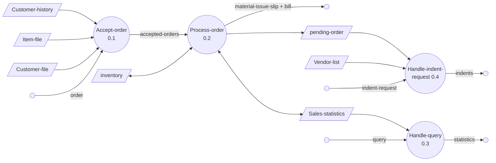

# 8. Structured Design — Examples & Structure Charts

> **Lecture:** L7b (15-09-2026 to 18-09-2026) · **Source:** `8.pdf` (*NIT-CS3501-L7b-Function-Oriented Software Design*)
> **Continues [Ch. 7](07-function-oriented-design.md).** Ch. 7 introduced DFDs, structure charts and the two transformation strategies. This lecture works through **three complete examples**, gives the **rules for drawing correct DFDs**, and lists the **shortcomings** of both DFDs and structure charts.

---

## 🎯 In one line

Draw a **correct DFD** (single-bubble context diagram, 3–7 bubbles per level, **no control information**). Then transform it into a **structure chart** by **transform analysis** (afferent → central transform → efferent) or **transaction analysis** (one transaction-centre module plus one module per transaction type).

---

## 1. Example: Trading-House Automation System (TAS) ⭐⭐⭐

**The problem.** A large trading house wants software to automate the **book-keeping** of its business. It has many **regular customers** who order various commodities.

| # | Requirement |
|---|---|
| 1 | The trading house keeps the **names and addresses** of regular customers. Each has a unique **customer identification number (CIN)**. |
| 2 | When an order arrives, the accounts department **checks credit-worthiness** by analysing the customer's **history of payments** against past bills. |
| 3 | **Not credit-worthy:** the order is not processed further, and an **order-rejection message** is generated. |
| 4 | **Credit-worthy:** the ordered items are checked against the **list of items the house deals with**. Items it does not deal with are not processed, and a message is generated for them. |
| 5 | Items it does deal with are checked for **availability in inventory**. |
| 6 | **Available in the desired quantity:** a **bill** with the customer's forwarding address is printed, plus a **material issue slip**. The customer takes the slip to the **store house**, collects the items, and the **inventory is adjusted**. |
| 7 | **Not available in sufficient quantity:** the out-of-stock items, the quantity ordered and the CIN are stored in a **"pending-order" file**. |
| 8 | The **purchase department** periodically issues a **generate-indent** command. The system then examines the pending-order file, finds the **total quantity required** for each item, looks up the **vendors** who supply those items in the vendor file, and **prints indents** to them. |
| 9 | TAS also answers **managerial queries**: statistics of items sold over a given period, with the quantity sold and the price realised. |

### Context diagram (level 0) ⭐⭐

```
                      query                              indent
   ┌─────────┐ ──────────────►  ╭────────────────╮  ──────────────► ▱ (printed
   │ Manager │                  │ Trading-House- │                    indent)
   └─────────┘ ◄──────────────  │  Automation-   │
                  statistics    │    System      │
                                │       0        │
   ┌──────────┐  order          │                │   generate-indent  ┌─────────────┐
   │ Customer │ ──────────────► │                │ ◄───────────────── │  Purchase-  │
   └──────────┘ ◄────────────── ╰────────────────╯                    │ Department  │
                  response                                            └─────────────┘
```

Three **external entities**: Manager, Customer and Purchase-Department. **One bubble** for the whole system.

### Level-1 DFD ⭐⭐⭐



**Four bubbles:** 0.1 Accept-order · 0.2 Process-order · 0.3 Handle-query · 0.4 Handle-indent-request.
**Data stores:** customer-history, customer-file, item-file, inventory, pending-order, sales-statistics, vendor-list.

> 📌 **Numbering:** the context bubble is **0**, and its level-1 children are **0.1, 0.2, …**. Their children would be 0.1.1, 0.1.2, and so on.

### Data dictionary for TAS ⭐⭐

```
response            = [bill + material-issue-slip, reject-message]
query               = period               /* from manager, about sales statistics */
period              = [date + date, month, year, day]
date                = year + month + day
year, month, day    = integer
order               = customer-id + {items + quantity}*
accepted-order      = order                /* ordered items available in inventory */
reject-message      = order + message      /* rejection message */
pending-orders      = customer-id + {items + quantity}*
customer-address    = name + house# + street# + city + pin
item-name, house#, street#, city, message = string
pin, customer-id, quantity                = integer
bill                = {item + quantity + price}* + total-amount + customer-address
material-issue-slip = message + item + quantity + customer-address
statistics          = {item + quantity + price}*
sales-statistics    = {statistics}*
```

Notation: `+` = and · `[a, b]` = **either** a or b · `{ }*` = zero or more repetitions · `/* */` = comment. → [Ch. 7 §7](07-function-oriented-design.md)

### Observations ⭐

- DFDs help create both a **data model** and a **function model**.
- As a DFD is refined into greater levels of detail, the analyst performs an **implicit functional decomposition**. At the same time, the **data is refined**.

---

## 2. Guidelines for constructing DFDs ⭐⭐⭐

| # | Guideline |
|---|---|
| 1 | The **context diagram represents the system as a single bubble.** Many beginners wrongly draw more than one. |
| 2 | **All external entities appear in the context diagram**, and **only** there. They should not appear at any other level. |
| 3 | **Only 3 to 7 bubbles per diagram.** Each bubble is decomposed into between 3 and 7 bubbles. |
| 4 | **A DFD does not represent control information**: not *when* or *in what order* functions are invoked, and not the *conditions* under which they are invoked. |
| 5 | **If bubble A invokes either B or C depending on a condition, show the data that flows from A to B and from A to C**, not the condition. |
| 6 | **All functions in the SRS must be captured.** No function specified in the SRS should be overlooked. |
| 7 | **Only functions in the SRS should be represented.** Do not assume extra functionality the SRS does not specify. |

### Example 1: why an arrow between bubbles is not a control flow

*"Check the input value. If it is < −1000 or > +1000, generate an error message; otherwise search for the number."*

```
               ╭──────────╮  ✗ (no data label = control flow — WRONG)
  number ────► │  Check   │ ─────────────►╭──────────╮
               │  number  │               │ Generate │──► message
               ╰────┬─────╯               │  Error   │
                    │ number              ╰──────────╯
                    ▼
               ╭──────────╮
               │  Search  │──► [found, not-found]
               ╰──────────╯
```

The unlabelled arrow from *Check-number* to *Generate-Error* only means *"invoke it if out of range"*. That is **control information**, so it is crossed out.

### Example 2: label the arrow with the data that flows

*"A function accepts the book name. If it is not valid, it generates an error message. If it is valid, it searches the database."*

```
                     Good-book-name     ╭──────────╮
               ╭──────────╮ ──────────► │  Search- │──► Book-details
 Book-name ──► │ Get-book-│             │   book   │
               │   name   │             ╰──────────╯
               ╰──────────╯ ──✗──►╭───────────╮
                                  │ Print-err-│──► Error-message
                                  │  message  │
                                  ╰───────────╯
```

The arrow to *Search-book* carries **data** (`Good-book-name`), so it is valid. The unlabelled arrow to *Print-err-message* is control, so it is **wrong**. It should instead carry the data it passes, for example `Bad-book-name`.

---

## 3. Commonly made errors in DFDs ⭐⭐⭐

1. **Unbalanced DFDs**: data in and out of a bubble doesn't match its decomposition. → [Ch. 7 §6](07-function-oriented-design.md)
2. **Forgetting to name the data flows.**
3. **Unrepresented functions or data.**
4. **External entities appearing at higher-level DFDs.**
5. **Trying to represent control aspects.**
6. **A context diagram with more than one bubble.**
7. **A bubble decomposed into too many bubbles** at the next level (more than 7).
8. **Terminating decomposition too early.**
9. **Nouns used to name bubbles.** Bubbles are functions, so name them with **verbs**.

> 💡 Memorise these nine. *"List common errors in constructing DFDs"* is a ready-made question.

---

## 4. Shortcomings of the DFD model ⭐⭐

| Shortcoming | Explanation / example |
|---|---|
| **Imprecise** | We infer what a bubble does **from its label**, and a label may not capture all its functionality. *Find-book-position* has only intuitive meaning. It doesn't say what happens if the input is missing or incorrect, if the book is not found, or if different authors have books with the same title. |
| **Control information not represented** | For example, the **order** in which inputs are consumed and outputs produced is not specified. |
| **Synchronisation not specified** | In TAS, the DFD doesn't say whether *process-order* waits until *accept-order* produces data, or whether the two proceed **simultaneously with a buffer** between them. |
| **Decomposition is subjective** | How decomposition is carried out, and to **what level**, depends on the analyst's judgement. The same problem allows **several alternative DFDs**, and often none can be called superior. |
| **No guidance on how to decompose** | There is no clear method for decomposing a function, and **no rule for when to stop**. |

### Extending DFDs to real-time systems: the Ward and Mellor technique ⭐

Real-time systems have **time bounds on actions**, so it is essential to model **control flow and events**.

- A new type of process (bubble) that **handles only control flows** is introduced. It is drawn as a **dashed circle**.
- **Data flow diagrams (DFD)** and **control flow diagrams (CFD)** are drawn **separately**.
- A **solid bar**, a notional reference to the **control specification (CSPEC)**, links the DFD and the CFD.
- The **CSPEC** describes the **effect of an external event or control signal**, and **which processes are invoked** as a consequence of an event.

---

## 5. Structured design and the structure chart ⭐⭐⭐

> **Aim of structured design:** transform the results of structured analysis (a **DFD**) into a **structure chart**.
>
> A **structure chart represents the software architecture**: the **modules** making up the system, **module dependency** (which module calls which), and the **parameters** passed among modules.

It is **easily implementable** in programming languages. It focuses on the **module structure** and **interaction among modules**. **Procedural aspects** (how a particular function is achieved) are **not represented**.

### Building blocks ⭐⭐

```
  ┌───────────────┐        ┌┬─────────────┬┐        root              root
  │ Process-order │        ││ Quick-sort  ││         │                 ◇
  └───────────────┘        └┴─────────────┴┘      ↙  ↓  ↘           ↙  ↓  ↘
     MODULE                 LIBRARY MODULE     (loop arc over      SELECTION
                          (double side edges)   the arrows =       (one of them,
                                                REPETITION)        by condition)

         root                        root
          │  ╲ order                  │
          ▼   ↙                       ▼
   ┌───────────────┐          ┌───────────────┐
   │ Process-order │          │ Process-order │
   └───────────────┘          └───────────────┘
   INVOCATION ARROW           DATA-FLOW ARROW (small arrow beside
   (control passes             the invocation arrow; data passes
   down the arrow)             in its direction)
```

| Symbol | Meaning |
|---|---|
| **Rectangular box** | A **module**, annotated with the module's name |
| **Module invocation arrow** | During execution, **control is passed** from one module to the other in the direction of the arrow |
| **Data flow arrow** | A small arrow **alongside** an invocation arrow: **data passes** from one module to another in its direction |
| **Library module** | A rectangle with **double side edges**. It represents a **frequently called** module and simplifies drawing when a module is called by several modules. |
| **Diamond (selection)** | **One** of the several modules connected to the diamond is invoked, **depending on some condition** |
| **Loop around control-flow arrows (repetition)** | The concerned modules are **invoked repeatedly** |

### Rules for a structure chart ⭐⭐

1. **Only one module at the top**: the **root** module.
2. **At most one control relationship between any two modules.** If A invokes B, B cannot invoke A. This lets the modules be arranged in **layers or levels**.
3. **The principle of abstraction:** lower-level modules must **not** invoke higher-level modules. **Two higher-level modules can invoke the same lower-level module.**

**Properly layered** (from the RMS example):
```
                         root
            valid-numbers↗   │↓rms    ↘rms
      ┌──────────────┐ ┌──────────────────┐ ┌──────────────────┐
      │ Get-good-data│ │ Compute-solution │ │ Display-solution │
      └──────┬───────┘ └────────┬─────────┘ └──────────────────┘
        ┌────┴─────┐            │
        ▼          ▼            │
  ┌──────────┐ ┌───────────────┐◄┘   ← Validate-data is shared by two
  │ Get-data │ │ Validate-data │       higher-level modules: ALLOWED
  └──────────┘ └───────────────┘
```

**Poorly layered:** arrows go **upwards**. M4 calls M2, M5 calls M1 and M6 calls M3, which violates layering and abstraction.

### Shortcomings of a structure chart ⭐⭐

- You **cannot** tell whether a module calls another **just once or many times**.
- You **cannot** tell the **order** in which the modules are invoked.

### Flow chart vs structure chart ⭐⭐

A **flow chart** represents the **flow of control** in a program. A structure chart differs from it in **three principal ways**:

| # | Flow chart | Structure chart |
|---|---|---|
| 1 | It is **difficult to identify the modules** of the software | The modules are shown explicitly |
| 2 | **Data interchange among modules is not represented** | The data passed between modules is shown |
| 3 | **Sequential ordering** of tasks is inherent | Sequential ordering is **suppressed** |

---

## 6. Transformation of a DFD into a structure chart ⭐⭐⭐

Two strategies: **transform analysis** and **transaction analysis**.
- Start with the **level-1 DFD**, transform it into a module representation using one of the two, then proceed to the lower-level DFDs.
- **At each level, first decide which strategy applies** to that particular DFD.

### 6.1 Transform analysis ⭐⭐⭐

**Step 1: divide the DFD into three parts.**

| Part | What it is | Name |
|---|---|---|
| **Input** | Processes that convert input data from **physical to logical form**, for example reading characters from a terminal into internal tables or lists | **Afferent branch**. There may be more than one. |
| **Output** | Processes that transform output data from **logical to physical form** | **Efferent branch** |
| **The rest** | The core processing | **Central transform** |

**How to find the central transform** (it takes experience and skill):
- **Trace the inputs** until you reach a bubble whose **output cannot be deduced from its inputs alone**.
- Processes that **validate** input or **add information** to it are **not** central transforms.
- Processes that **sort** input or **filter** data from it **are** central transforms.

**Step 2: derive the first-level structure chart.** Draw **one box for each afferent branch**, **one box for each efferent branch**, and **one box for the central transform**, all under the root.

**Step 3: factoring.** Break functional components into sub-components, adding:
- **read** and **write** modules,
- **error-handling** modules,
- **initialisation** and **termination** modules, etc.

Many levels of modules may be needed. **Finally, check that every bubble has been mapped to a module.**

### Worked Example 1: RMS calculating software ⭐⭐⭐

**Requirement:** accept input numbers from the user, **validate** them, **calculate the root mean square**, and **display** the result.

**Context diagram:** `User` sends **data-items** to **Compute-RMS (0)**, which returns the **result**.

**Level-1 DFD:**
```
                  numbers
  data-items ──► (Read-numbers 0.1) ──────► (Validate-numbers 0.2)
                ╰────── AFFERENT ──────╯          │ valid-numbers      │ error
                                                  ▼                    │
                                        (Compute-rms 0.3)              │
                                                  │ RMS                │
                                                  ▼                    ▼
                                         ╭──── (Display 0.4) ◄─────────╯
                                         ╰── EFFERENT ──╯──► result
```

- **Afferent branch:** Read-numbers + Validate-numbers. Validation is not a central transform.
- **Central transform:** Compute-rms.
- **Efferent branch:** Display.

**Structure chart:**
```
                              root
         valid-numbers ↖     ↓ valid-numbers ↑ rms      rms ↘
   ┌───────────────┐   ┌──────────────────┐   ┌──────────────────┐
   │ Get-good-data │   │ Compute-solution │   │ Display-solution │
   └───────┬───────┘   └──────────────────┘   └──────────────────┘
      ┌────┴──────┐
      ▼           ▼
 ┌──────────┐ ┌───────────────┐
 │ Get-data │ │ Validate-data │
 └──────────┘ └───────────────┘
```

### Worked Example 2: Tic-tac-toe computer game ⭐⭐

**Requirement:** a human plays against the computer. As soon as either wins, a **congratulation message** is displayed. If neither gets three consecutive marks in a straight line and all squares are filled, the game is **drawn**. The computer always tries to win.

**Context diagram:** `Human Player` sends **move** to **Tic-tac-toe software (0)**, which returns **display**.

**Level-1 DFD:**
```
  move ──► (Validate-move) ──► ═══ board ═══ ──► (Check-winner) ──► result
           ╰─ AFFERENT ─╯          ▲   │
                                   │   ▼
                             (Play-move)  (Display-board) ──► game
                                          ╰── EFFERENT ──╯
```

**Structure chart:**
```
                               root
          ┌─────────────────────┼─────────────────────┐
          ▼                     ▼                     ▼
  ┌───────────────┐    ┌───────────────┐       ┌─────────┐
  │ Get-good-move │    │ Compute-game  │       │ Display │
  └───────┬───────┘    └───────┬───────┘       └─────────┘
     ┌────┴─────┐         ┌────┴──────┐
     ▼          ▼         ▼           ▼
 ┌────────┐ ┌──────────┐ ┌───────────┐ ┌──────────────┐
 │Get-move│ │ Validate-│ │ Play-move │ │ Check-winner │
 └────────┘ │   move   │ └───────────┘ └──────────────┘
            └──────────┘
```

### 6.2 Transaction analysis ⭐⭐⭐

Useful for designing **transaction-processing** programs.

| **Transform-centred systems** | **Transaction-driven systems** |
|---|---|
| **Similar processing steps for every data item**, processed by input, process and output bubbles | **One of several possible paths** through the DFD is traversed, **depending on the input data value** |

**Transaction:** any **input data value that triggers an action**. For example, selected **menu options** might trigger different functions. A transaction is represented by a **tag** identifying its type.

Transaction analysis **uses this tag** to divide the system into **one transaction-centre module** and **several transaction modules**:

```
                    ┌────────────────────┐
                    │ Transaction-center │
                    └─────────┬──────────┘
          trans 1 ↙           │ trans 2 ↓        ↘ trans 3
         ┌────────┐      ┌────────┐       ┌────────┐
         │ type 1 │      │ type 2 │       │ type 3 │
         └───┬────┘      └───┬────┘       └───┬────┘
           ↙ ↓ ↘           ↙ ↓ ↘            ↙ ↓ ↘
```

### Worked Example 3: TAS by transaction analysis ⭐⭐⭐

TAS receives **three kinds of transaction**: an **order** from a customer, an **indent request** from the purchase department, and a **query** from the manager. Each follows a different path through the level-1 DFD (§1), so **transaction analysis** applies.

```
                               root
              order ↙           ↓ indent            ↘ query
    ┌──────────────┐    ┌───────────────┐    ┌──────────────┐
    │ Handle-order │    │ Handle-indent │    │ Handle-query │
    └──────┬───────┘    └───────────────┘    └──────────────┘
      ┌────┼─────────────┐
      ▼    ▼             ▼
┌─────────┐┌──────────────┐┌───────────────┐
│Get-order││ Accept-order ││ Process-order │
└─────────┘└──────────────┘└───────────────┘
```

> 💡 **How to choose between them:** in RMS and tic-tac-toe **every input goes through the same steps** (read → validate → compute → display), so use **transform analysis**. In TAS the **type of input** decides which path is taken, so use **transaction analysis**.

---

## 7. Summary (from the lecture)

- Structured analysis was applied to a **larger problem** (TAS).
- **General guidelines** were given for a satisfactory DFD.
- The DFD model, though simple and useful, **has several shortcomings**.
- **Structured design** transforms a DFD into a **structure chart**, which shows the **module structure** and the **interaction among modules**, but **not procedural aspects**.
- Structured design has **two strategies**: **transform analysis** and **transaction analysis**.
- **Three examples:** RMS, Tic-tac-toe and TAS.
- *"It takes a lot of practice to become a good software designer."*

---

## 8. Common exam questions

1. **Draw the context diagram and level-1 DFD for the Trading-House Automation System.** ⭐⭐⭐ Also practise library, ATM and hostel systems.
2. **Write the data dictionary** for a given DFD. ⭐⭐
3. **State the guidelines for constructing DFDs.** ⭐⭐ → §2, 7 points.
4. **What are the common errors made while drawing DFDs?** ⭐⭐⭐ → §3, 9 points.
5. **What are the shortcomings of the DFD model?** ⭐⭐ → imprecise labels, no control or synchronisation, subjective decomposition, no stopping rule.
6. **How is the DFD technique extended to real-time systems?** ⭐ → Ward and Mellor: dashed control bubbles, separate CFD, CSPEC.
7. **What is a structure chart? Explain its building blocks.** ⭐⭐⭐ → six symbols.
8. **Differentiate a flow chart from a structure chart.** ⭐⭐ → three ways.
9. **What are the shortcomings of a structure chart?** ⭐ → no call count, no invocation order.
10. **Explain transform analysis with an example.** ⭐⭐⭐ → afferent / central transform / efferent, factoring; RMS.
11. **Explain transaction analysis with an example.** ⭐⭐⭐ → transaction centre + transaction modules; TAS.
12. **Distinguish transform-centred and transaction-driven systems.** ⭐⭐

---

## ⚡ Quick revision

- **Decompose how long?** Simple problems: **level 1**. Large industry problems: **level 3–4**. **Rarely beyond level 4.**
- **TAS:** external entities are Customer, Manager and Purchase-Department. Level-1 bubbles are **Accept-order 0.1, Process-order 0.2, Handle-query 0.3, Handle-indent-request 0.4**.
- **DFD guidelines:** one bubble in the context diagram · external entities **only** in the context diagram · 3–7 bubbles · **no control information** (show data flows, not conditions) · all SRS functions and **only** SRS functions.
- **9 common errors:** unbalanced · unnamed flows · missing functions/data · external entities at higher levels · control aspects · >1 context bubble · too many bubbles · stopping too early · **noun** names.
- **DFD shortcomings:** imprecise labels · no control · no synchronisation · subjective decomposition · no stopping rule.
- **Ward and Mellor:** dashed control bubbles · separate CFD · solid bar → **CSPEC**.
- **Structure chart:** one **root** · at most one control relationship between two modules · lower levels never call higher levels (shared lower modules are fine) · **no call count, no invocation order**.
- **Symbols:** box = module · arrow = invocation · small arrow = data · **double-edged box = library module** · **diamond = selection** · **loop arc = repetition**.
- **Flow chart vs structure chart:** modules hard to identify · no data interchange · sequential order suppressed in a structure chart.
- **Transform analysis:** afferent (physical → logical) · **central transform** (validate/add info = NOT central; sort/filter = central) · efferent (logical → physical). Then **factor**: read/write, error handling, init/termination.
- **Transaction analysis:** transaction = an input value that triggers an action, identified by a **tag**. One **transaction-centre** module plus several transaction modules.

---

**Previous:** [← 7. Function-Oriented Design](07-function-oriented-design.md) · **Next:** [9. Mid-Sem 2025 Paper — Solved →](09-mid-sem-2025-paper-solved.md)
