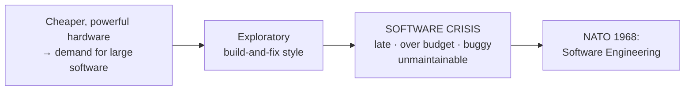
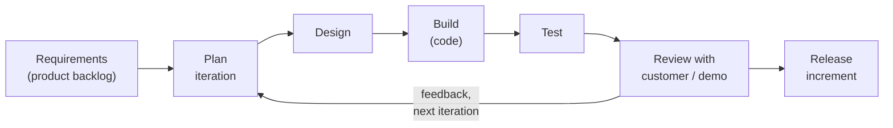
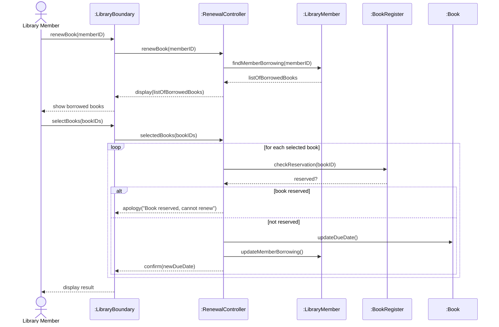

# 9. Mid-Semester Paper 2025 — Solved

> **Source:** `MID-SEM- SE_2025.pdf`. *NIT Manipur, B.Tech Sem V (CSE), Mid Semester, Jul–Dec 2025, Software Engineering (CS301). Full marks 30, 1:30 hours.*
> **Why this chapter exists:** it is **last year's actual mid-sem paper**. It shows the pattern: one 6 × 1-mark definitions question, then four 6-mark questions with an **either/or** choice between Q3 and Q4.

## Paper at a glance

| Q | Question | Marks | CO | Covered in |
|---|---|---|---|---|
| 1 | Explain six terms | 1 × 6 | CO1/CO2 | Mixed, see below |
| 2 | Software engineering + the 1960s software crisis | 6 | CO1 | [Ch. 1](01-introduction-to-software-engineering.md) (crisis only briefly) |
| 3 | Waterfall life cycle model | 6 | CO1 | [Ch. 2](02-software-life-cycle-models.md) ✅ |
| 4 | *or* Agile life cycle model | 6 | CO1 | ⚠️ **Not in lectures L1–L7**, answered in full below |
| 5 | SRS document and its organization, with an example | 6 | CO2 | [Ch. 3](03-requirements-analysis-and-srs.md) ✅ |
| 6 | "Renew book" use case + sequence diagram | 6 | CO2 | ⚠️ **Not in lectures L1–L7** (UML), answered in full below |

> ⚠️ **Coverage warning.** The 2025 paper asks about **Agile, UML, use cases, sequence diagrams and inheritance**. None of these appear in this year's lectures L1–L7. Either they come later in the course (object-oriented design), or they were in the missing **Lecture 5**. **Learn the answers below anyway**, because they carry 6 + 6 + 2 marks.

---

## Q1. Explain the following terms (1 × 6)

Write two or three lines for each. One mark does not need more.

**[i] Feasibility study** *(CO1)*
The **first phase** of the waterfall model. It determines whether developing the product is **financially and technically viable**. It weighs the rough cost and time of candidate solutions against the benefits, and picks one approach or decides the project is not worth doing. → [Ch. 2 §2](02-software-life-cycle-models.md)

**[ii] Structured programming** *(CO1)*
A programming discipline in which a program uses only **three control constructs: sequence, selection (`if`/`switch`) and iteration (`while`/`for`)**. It avoids unstructured `goto` jumps. Each block has a **single entry and single exit**, so the program is easier to read, test and maintain. It was proposed by Dijkstra (1968, *"Go To Statement Considered Harmful"*).

**[iii] Decision tree in requirement specification** *(CO2)*
A **graphical, tree-shaped** way of specifying complex processing logic. Internal nodes are **conditions**, branches are condition outcomes, and leaves are the **actions** to take. It shows the order in which conditions are checked and makes the logic easy for the customer to verify. The example used in class is the Library Membership Software. → [Ch. 4](04-decision-tables-and-trees.md)

**[iv] Inheritance** *(CO2)*
An object-oriented mechanism in which a **subclass (derived class)** acquires the attributes and methods of a **superclass (base class)**, and may add to or override them. It models an **"is-a"** relationship, such as `Car` is-a `Vehicle`. It promotes **reuse** and extensibility. In UML it is drawn as a line with a **hollow triangle** pointing at the superclass.

**[v] UML (Unified Modeling Language)** *(CO2)*
A **standard graphical modelling language** for specifying, visualising and documenting object-oriented software. It was created by Booch, Rumbaugh and Jacobson and standardised by the OMG. It is a *notation*, not a methodology. It provides several diagram types organised into **views**: use case, class, object, sequence, collaboration, state-chart, activity, component and deployment diagrams.

**[vi] Functional requirements** *(CO2)*
Requirements that describe **what the system must do**. Each one is a function that transforms **input data → processing → output data**. Example: *"The system shall allow a member to renew a borrowed book."* They contrast with **non-functional** requirements, which describe *how well* the system works. → [Ch. 3 §4.1](03-requirements-analysis-and-srs.md)

---

## Q2. What is software engineering? Explain the software crisis that plagued software industries in the 1960s. (6)

### Software engineering (2 marks)

> **Software engineering** is the application of a **systematic, disciplined, quantifiable** approach to the development, operation and maintenance of software (IEEE). Put another way, it is **a systematic collection of past experience**, arranged as techniques, methodologies and guidelines, for developing software **cost-effectively**.

It rests on two fundamental principles, **abstraction** and **decomposition**. It turns effort that grows exponentially with program size into effort that grows almost linearly. → [Ch. 1](01-introduction-to-software-engineering.md)

### The software crisis (4 marks)

In the 1960s, hardware became much more powerful and cheaper. The software demanded of it (operating systems, airline reservation systems, defence systems) grew far larger than the programmers' **exploratory, build-and-fix** style could handle. The term "software crisis" was used at the **1968 NATO Software Engineering Conference**, the same conference that coined the term *software engineering*.

**Symptoms:**

| Symptom | What happened |
|---|---|
| **Over budget** | Actual costs were many times the estimates |
| **Late delivery** | Schedules slipped by months or years |
| **Unreliable** | Delivered software was full of bugs and failed in use |
| **Did not meet requirements** | Users got something other than what they asked for |
| **Unmaintainable** | Code was so tangled that fixing one bug introduced others |
| **Cancelled projects** | Many projects were abandoned after large investment |
| **Rising software share of cost** | Hardware costs fell while software costs rose, making software the dominant cost of a system |

**Causes:**
1. **Growing size and complexity** of programs, beyond one person's grasp (the limit of human cognition, [Ch. 1 §4](01-introduction-to-software-engineering.md)).
2. **Exploratory programming style.** There was no life cycle model, no design and no documentation.
3. **Poor project management.** There was no reliable way to estimate cost or schedule.
4. **Lack of trained software professionals** and of systematic testing.
5. **Frequently changing requirements** with no process to control them.

**Classic example:** IBM's **OS/360** was delivered late, over budget and full of errors. Fred Brooks, its manager, later wrote *The Mythical Man-Month* about it.

**Remedy:** the crisis led to **software engineering** itself, with life cycle models, structured programming, formal requirements (SRS) and systematic design and testing.



---

## Q3. Explain the waterfall life cycle model. (6)

This is fully covered in → [Ch. 2 §2–3](02-software-life-cycle-models.md). Exam-length answer:

The **classical waterfall model** divides the life cycle into **six sequential phases**. Each phase starts only after the previous one is complete, and the work flows downward like a waterfall.

```
 ┌──────────────────┐
 │ Feasibility Study│
 └────────┬─────────┘
          ▼
   ┌──────────────────────────┐
   │ Requirements Analysis    │
   │ & Specification (SRS)    │
   └────────┬─────────────────┘
            ▼
       ┌─────────┐
       │ Design  │
       └────┬────┘
            ▼
     ┌────────────────────┐
     │ Coding & Unit Test │
     └────────┬───────────┘
              ▼
       ┌─────────────────────────────┐
       │ Integration & System Testing│
       └────────┬────────────────────┘
                ▼
          ┌─────────────┐
          │ Maintenance │
          └─────────────┘
```

| Phase | Purpose | Output |
|---|---|---|
| **Feasibility study** | Is the project financially and technically viable? | Feasibility report |
| **Requirements analysis & specification** | Understand and document exactly what the customer wants | **SRS document** |
| **Design** | Turn the SRS into an architecture and module structure | Design document |
| **Coding & unit testing** | Implement each module and test it in isolation | Tested modules |
| **Integration & system testing** | Combine modules step by step, then test the whole system (α, β, acceptance) | Working system |
| **Maintenance** | Corrective, perfective and adaptive changes after delivery. This is the **largest effort** of all phases. | Updated system |

**Advantages:** simple and easy to understand · clear milestones and documents at each phase · works well when requirements are **stable and well understood**.

**Shortcomings:** it **assumes no errors** are made in any phase, and has **no feedback path** to go back · requirements must be frozen at the start · the customer sees nothing until the end · it cannot accommodate change. The **iterative waterfall model** fixes the no-feedback problem by adding feedback paths from each phase back to earlier phases.

---

## Q4. *(or)* Explain the Agile life cycle model. (6)

> ⚠️ Not covered in lectures L1–L7. This is a complete answer from standard SE theory.

### Definition

**Agile** is a family of **iterative and incremental** development methods. Software is delivered in **small, working increments** over short, fixed-length **iterations** (typically 1–4 weeks), with close customer collaboration and **welcoming of changing requirements**. It was formalised in the **Agile Manifesto (2001)**.

### The four values of the Agile Manifesto

| Agile values… | …over |
|---|---|
| **Individuals and interactions** | processes and tools |
| **Working software** | comprehensive documentation |
| **Customer collaboration** | contract negotiation |
| **Responding to change** | following a plan |

### Key principles
- Customer satisfaction through **early and continuous delivery** of working software
- **Welcome changing requirements**, even late in development
- Deliver working software **frequently** (weeks, not months)
- Business people and developers **work together daily**
- **Face-to-face conversation** is the best way to communicate
- **Working software is the primary measure of progress**
- Regular **reflection** (retrospectives) to improve

### The Agile life cycle



Each iteration is a **mini-project** containing all the activities (plan → design → code → test → review) and ends with a **working, potentially shippable increment**. Customer feedback from the review feeds the next iteration.

### Popular agile methods
- **Scrum:** work is done in **sprints** (2–4 weeks). Roles are *Product Owner*, *Scrum Master* and *Development Team*. It uses a *product backlog*, a *sprint backlog*, a **daily stand-up meeting**, a *sprint review* and a *retrospective*.
- **Extreme Programming (XP):** pair programming, test-driven development, continuous integration, small releases, refactoring.
- Others: Kanban, Crystal, Feature-Driven Development (FDD), DSDM, Lean.

### Advantages and disadvantages

| ✅ Advantages | ❌ Disadvantages |
|---|---|
| Handles **changing requirements** easily | Hard to estimate total cost and time up front |
| Customer sees working software **early** and often | Needs **constant customer involvement** |
| Early detection of defects | **Less documentation**, which makes later maintenance harder |
| Lower risk: each increment is small | Hard to scale to very large or distributed teams |
| High customer satisfaction | Depends heavily on skilled, experienced team members |

### Waterfall vs Agile

| | **Waterfall** | **Agile** |
|---|---|---|
| Approach | Sequential, linear | Iterative, incremental |
| Requirements | Frozen at the start | Evolve continuously |
| Delivery | Once, at the end | Frequently, every iteration |
| Customer involvement | At the start and end | Throughout |
| Documentation | Heavy | Light ("just enough") |
| Best for | Stable, well-understood requirements | Changing or unclear requirements |

---

## Q5. What is a software requirements specification document? Explain the organization of its structure with an example. (6)

Covered in → [Ch. 3 §4–6](03-requirements-analysis-and-srs.md).

### Definition (1 mark)

The **SRS (Software Requirements Specification)** is the document produced at the end of the **requirements analysis and specification phase**. It describes **what** the system must do, not how. It is written so the **customer can understand it**, yet it must be **unambiguous** for developers. It acts as the **contract** between customer and developer, the reference for design, and the basis for testing.

It contains three important parts: **functional requirements**, **non-functional requirements**, and **goals of implementation**.

### Organization (3 marks)

The class structure, which also matches the outline of **IEEE 830**:

| Section | Contents |
|---|---|
| **1. Introduction** | 1.1 Purpose · 1.2 Scope · 1.3 Definitions, acronyms, abbreviations · 1.4 References · 1.5 Overview |
| **2. Overall description** | Product perspective · product functions · user characteristics · constraints · assumptions and dependencies |
| **3. Functional requirements** | Each function numbered: **input → processing → output** |
| **4. Non-functional requirements** | External interfaces (user, hardware, software) · performance · reliability · security · maintainability · portability |
| **5. Goals of implementation** | Non-binding suggestions: future extensions, reuse, new devices |

### Example: SRS outline for an Automated Library System (2 marks)

**1. Introduction**
- *Purpose:* automate issue, return, renewal and search of books for the NIT Manipur library.
- *Scope:* used by members (students and faculty) and the librarian.

**2. Overall description:** the system runs on the campus LAN. Members authenticate with their roll number or employee ID.

**3. Functional requirements**
- **R1 Issue book.** *Input:* member ID, book accession number. *Processing:* check the borrowing limit and availability. *Output:* issue record with due date.
- **R2 Return book.** *Input:* accession number. *Processing:* compute any fine. *Output:* updated record and fine receipt.
- **R3 Renew book.** *Input:* member ID, accession number. *Processing:* refuse if the book is reserved by another member or the renewal limit is reached. *Output:* new due date or a refusal message.
- **R4 Search catalogue.** *Input:* title, author or keyword. *Output:* list of matching books with their availability.

**4. Non-functional requirements**
- Response time **< 2 s** for any query.
- Handles **500 concurrent users**.
- Data backed up daily; passwords stored hashed.

**5. Goals of implementation**
- Should later support RFID self-checkout and a mobile app.

---

## Q6. Describe the "renew book" use case of an automated library system with a diagram, and develop its sequence diagram from it. (6)

> ⚠️ UML is not covered in lectures L1–L7. This is a complete answer following the standard textbook (Rajib Mall) treatment of this exact example.

### Use case description (2 marks)

| Field | Value |
|---|---|
| **Use case** | Renew Book |
| **Primary actor** | Library Member |
| **Precondition** | The member is registered and currently has the book(s) issued |
| **Postcondition** | The due date of each renewed book is extended and the records are updated |

**Main success scenario:**
1. The member selects **Renew Book**.
2. The system displays the list of books currently borrowed by the member.
3. The member selects the book(s) to renew.
4. The system checks each selected book: it must **not be reserved** by another member, and the **renewal limit** must not be reached.
5. The system extends the due date and updates the records.
6. The system displays a **confirmation** with the new due dates.

**Alternative scenarios:**
- **4a.** The book is **reserved** by another member → the system displays *"Sorry, book is reserved, cannot renew"* and the book must be returned.
- **4b.** The **renewal limit** is reached → the system refuses the renewal.
- **2a.** The member has **no books** issued → the system displays *"No books to renew"*.

### Use case diagram (1 mark)

```
                    ┌────────────── Library Information System ──────────────┐
                    │                                                         │
                    │      ( Issue Book )                                     │
       O            │                                                         │
      /|\  ─────────┼────► ( Renew Book ) - - «include» - - ► ( Check        │
      / \           │                                          Reservation )  │
  Library           │      ( Return Book )                                    │
  Member   ─────────┼────► ( Search Catalogue )                               │
                    │                                                         │
                    └─────────────────────────────────────────────────────────┘
```

Draw the **actor** as a stick figure outside the system boundary rectangle, and each **use case** as an **ellipse** inside it. Join the actor to each use case with a plain line (an association).

### Sequence diagram (3 marks)

**How to derive it from the use case:** each step of the scenario becomes a message. The objects are one **boundary** object (the UI), one **controller** object (for the use case), and the **entity** objects that hold the data.

- `:LibraryBoundary` is the user interface (boundary object).
- `:RenewalController` coordinates the use case (controller object).
- `:LibraryMember`, `:BookRegister`, `:Book` are the entity objects.



**Reading the diagram:**
- **Objects** are listed across the top. A dashed **lifeline** runs down from each one.
- **Time flows downward.**
- A **solid arrow** is a message (method call). A **dashed arrow** is a return.
- A **`loop`** box repeats for each selected book. An **`alt`** box shows the reserved / not-reserved branches, which are drawn as **[guard conditions]** in UML.
- Draw a thin **activation bar** on a lifeline while that object is executing.

---

## Answering strategy for this paper

- **Q1** is 6 marks for 6 definitions, so spend no more than about 10 minutes on it. Write one crisp sentence plus one example for each term.
- **Q3 or Q4:** if you know Q3 cold from Ch. 2, pick it. **Always draw the diagram.**
- **Q5:** the **example** is explicitly asked for, so do not skip it.
- **Q6:** marks are split across the use case **description**, the use case **diagram** and the **sequence diagram**. Give all three.
- Budget: 90 minutes for 30 marks ≈ **3 minutes per mark**.

---

## ⚡ Quick revision

- **Structured programming** = sequence + selection + iteration only, no `goto`, single entry and single exit.
- **Inheritance** = a subclass acquires the superclass's attributes and methods ("is-a"); UML hollow triangle.
- **UML** = a standard OO modelling *notation* (not a method); use case, class, sequence, activity, state… diagrams.
- **Software crisis (1960s):** late · over budget · unreliable · unmaintainable. Caused by growing complexity and the exploratory style. Led to the NATO 1968 conference, where "software engineering" was coined.
- **Agile:** iterative and incremental, short iterations, working software each iteration, welcomes change. **Manifesto (2001), 4 values.** Scrum (sprints, daily stand-up) and XP (pair programming, TDD).
- **SRS:** Introduction → Overall description → Functional reqs → Non-functional reqs → Goals of implementation.
- **Sequence diagram:** boundary → controller → entity objects; time flows down; `loop` and `alt` boxes; guard conditions.

---

**Previous:** [← 8. Structured Design — Examples & Structure Charts](08-structured-design-examples-and-structure-charts.md) · **Back to:** [SE index](../README.md)
